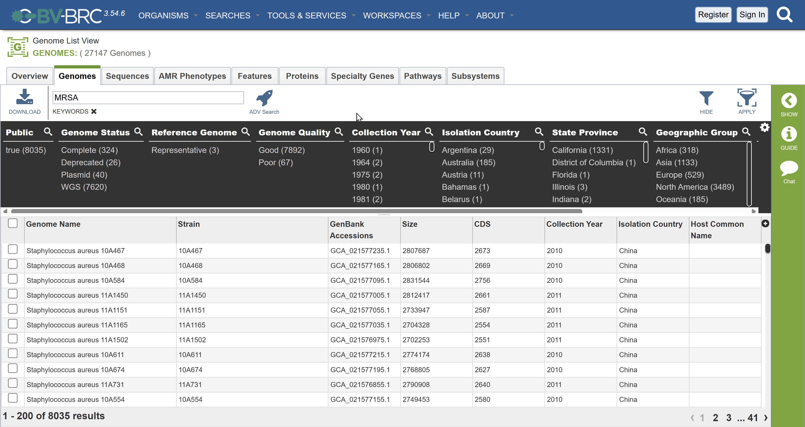
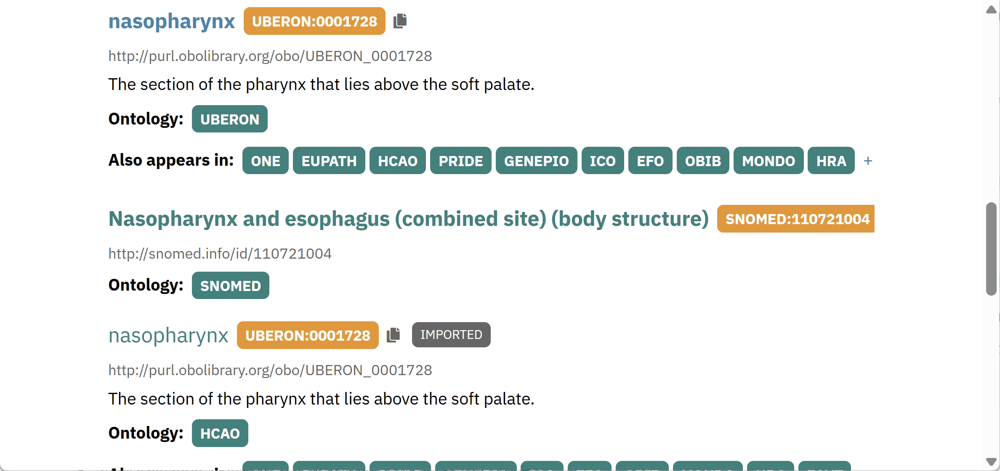

--- 
title: "Pathogen Genomic Epidemiology 2025"
author: "Faculty: Angela McLaughlin, Emma Griffiths, Finlay Maguire, Gary Van Domselaar, Idowu Olawoye, Jennifer Guthrie, Zhibin Lu, Charlie Barclay,"
date: "November 24-26, 2025"
site: bookdown::bookdown_site
documentclass: book
bibliography: [book.bib, packages.bib]
url: https://bioinformaticsdotca.github.io/PGE_2025/ 
cover-image: img/bioinformatics_logo.png
description: |
  Workshop website for the 2025 Pathogen Genomic Epidemiology Canadian Bioinformatics Workshop
link-citations: yes
github-repo: bioinformaticsdotca/PGE_2025
favicon: img/favicon.ico
---

# (PART) Introduction {-}

# Workshop Info

Welcome to the 2025 Pathogen Genomic Epidemiology Canadian Bioinformatics Workshop webpage!  

## Pre-work

<!--[You can find your pre-work here.](LINK TO PREWORK)-->

## Class Photo

Coming soon! 

## Schedule

```{r schedule-loader, echo=FALSE, message=FALSE, warning=FALSE}
# --- Self-Contained R-Markdown Schedule Component ---
# To format your schedule csv, go here: https://cbw-dev.github.io/smart-scheduler/

# 1. Load necessary libraries
library(readr)
library(jsonlite)
library(htmltools)

# 2. Define the path to your schedule data
csv_path <- "schedule.csv"

# 3. Check if the CSV file exists
if (!file.exists(csv_path)) {
  stop("Error: 'schedule.csv' not found. Please create it in your project directory.")
}

# 4. Read the schedule data, ensuring all columns are character type
schedule_df <- readr::read_csv(
  csv_path,
  col_types = cols(.default = "c"),
  show_col_types = FALSE
)

# 5. Convert the data frame to a JSON object
schedule_json <- jsonlite::toJSON(schedule_df, auto_unbox = FALSE, na = "string")

# 6. Define the HTML structure, CSS, and JavaScript using htmltools
schedule_component <- tagList(
  # A. CSS for the design
  tags$style(HTML("
    :root {
      --schedule-primary-color: #4A6BFF;
      --schedule-border-color: #EAECEF;
      --schedule-text-color: #555;
    }
    .schedule-card {
      font-family: -apple-system, BlinkMacSystemFont, 'Segoe UI', Roboto, Oxygen, Ubuntu, Cantarell, 'Open Sans', 'Helvetica Neue', sans-serif;
      border: 1px solid var(--schedule-border-color);
      border-radius: 12px;
      margin: 2em 0;
      box-shadow: 0 4px 12px rgba(0,0,0,0.05);
      overflow: hidden;
    }
    .schedule-tabs {
      display: flex;
      justify-content: space-between;
      align-items: center;
      border-bottom: 1px solid var(--schedule-border-color);
      background-color: #fff;
    }
    .schedule-tabs-wrapper {
      position: relative;
      flex-grow: 1;
      overflow: hidden;
    }
    .schedule-tabs-wrapper::before,
    .schedule-tabs-wrapper::after {
      content: '';
      position: absolute;
      top: 0;
      bottom: 0;
      width: 50px;
      pointer-events: none;
      transition: opacity 0.2s;
      opacity: 0;
    }
    .schedule-tabs-wrapper::before {
      left: 0;
      background: linear-gradient(to left, rgba(255,255,255,0), #fff 70%);
    }
    .schedule-tabs-wrapper::after {
      right: 0;
      background: linear-gradient(to right, rgba(255,255,255,0), #fff 70%);
    }
    .schedule-tabs-wrapper.scrolled-left::before { opacity: 1; }
    .schedule-tabs-wrapper.scrolled-right::after { opacity: 1; }
    
    .schedule-tab-buttons {
      display: flex;
      overflow-x: auto;
      white-space: nowrap;
      -ms-overflow-style: none;
      scrollbar-width: none;
      scroll-behavior: smooth;
    }
    .schedule-tab-buttons::-webkit-scrollbar { display: none; }
    
    .timezone-selector-container {
      display: flex;
      align-items: center;
      gap: 0.75em;
      padding: 0 20px;
    }
    .timezone-selector-container label {
      font-size: 0.9em;
      color: var(--schedule-text-color);
      font-weight: 500;
    }
    .schedule-tabs select {
      padding: 6px 10px;
      border-radius: 6px;
      border: 1px solid #ccc;
      background-color: #fff;
    }
    .schedule-tab {
      padding: 14px 20px;
      cursor: pointer;
      border-bottom: 3px solid transparent;
      margin-bottom: -1px;
      color: var(--schedule-text-color);
      font-weight: 500;
    }
    .schedule-tab.active {
      color: var(--schedule-primary-color);
      border-bottom-color: var(--schedule-primary-color);
    }
    .schedule-panel { display: none; }
    .schedule-panel.active { display: block; }
    .schedule-table { width: 100%; border-collapse: collapse; }
    .schedule-table th, .schedule-table td {
      text-align: left;
      padding: 14px 20px;
      border-bottom: 1px solid var(--schedule-border-color);
    }
    .schedule-table th {
      color: #888;
      font-size: 0.8em;
      font-weight: 600;
      text-transform: uppercase;
      background-color: #F8F9FA;
    }
    .schedule-table tr:last-child td { border-bottom: none; }
    
    /* --- RULE FOR BREAKS AND PAUSES --- */
    .schedule-table tr.is-break td {
      font-style: italic;
      font-size: 0.95em;
      color: #777;
    }
    
    /* --- NEW: RULE FOR 'OTHER' TYPE (More Visible) --- */
    .schedule-table tr.is-other td {
      background-color: #f0f4ff; /* A light blue background */
      font-weight: 500; /* Slightly bolder text */
    }
    .schedule-table tr.is-other td:first-child {
      border-left: 4px solid var(--schedule-primary-color);
    }
  ")),

  # B. HTML placeholders
  div(class = "schedule-card",
      div(class = "schedule-tabs", id = "schedule-tabs-container"),
      div(class = "schedule-content", id = "schedule-panels-container")
  ),

  # C. JavaScript to build the interface
  tags$script(HTML(paste0('
    document.addEventListener("DOMContentLoaded", function() {
      const scheduleData = ', jsonlite::toJSON(schedule_df, auto_unbox = TRUE, na = "string"), ';
      const tabsContainer = document.getElementById("schedule-tabs-container");
      const panelsContainer = document.getElementById("schedule-panels-container");

      if (scheduleData.length === 0) return;

      const timezones = [];
      const firstRow = scheduleData[0];
      for (const key in firstRow) {
        if (key.match(/timezone_\\d+_label/)) {
          const index = key.match(/\\d+/)[0];
          timezones.push({ index: index, label: firstRow[key] });
        }
      }
      const days = [...new Set(scheduleData.map(row => row.day_label))];
      
      const tabsWrapper = document.createElement("div");
      tabsWrapper.className = "schedule-tabs-wrapper";
      const tabButtonsContainer = document.createElement("div");
      tabButtonsContainer.className = "schedule-tab-buttons";
      tabsWrapper.appendChild(tabButtonsContainer);
      tabsContainer.appendChild(tabsWrapper);

      days.forEach((day, dayIndex) => {
        const tab = document.createElement("div");
        tab.className = "schedule-tab";
        tab.dataset.target = `panel-${dayIndex}`;
        tab.textContent = day;
        tabButtonsContainer.appendChild(tab);
      });

      if (timezones.length > 1) {
        const selectorContainer = document.createElement("div");
        selectorContainer.className = "timezone-selector-container";
        let selectorHtml = `<label for="tz-selector">Timezone</label>
                            <select id="tz-selector">`;
        timezones.forEach(tz => {
          selectorHtml += `<option value="${tz.index}">${tz.label}</option>`;
        });
        selectorHtml += `</select>`;
        selectorContainer.innerHTML = selectorHtml;
        tabsContainer.appendChild(selectorContainer);
      }
      
      const tzSelector = document.getElementById("tz-selector");

      days.forEach((day, dayIndex) => {
        panelsContainer.innerHTML += `<div class="schedule-panel" id="panel-${dayIndex}"></div>`;
      });
      
      const tabs = document.querySelectorAll(".schedule-tab");
      const panels = document.querySelectorAll(".schedule-panel");

      function renderTables() {
        const selectedTzIndex = tzSelector ? tzSelector.value : timezones[0].index;
        const timeCol = `time_${selectedTzIndex}`;
        let selectedTzLabel = tzSelector ? tzSelector.options[tzSelector.selectedIndex].text : timezones[0].label;
        
        panels.forEach((panel, dayIndex) => {
          const day = days[dayIndex];
          const dayEvents = scheduleData.filter(row => row.day_label === day);
          let tableHtml = `<table class="schedule-table"><thead><tr>
                               <th style="width:25%;">${selectedTzLabel}</th>
                               <th>Activity</th>
                               </tr></thead><tbody>`;
          dayEvents.forEach(row => {
            const type = row.type ? row.type.toLowerCase() : "";
            let rowClass = "";

            if (type === "break" || type === "pause") {
              rowClass = "class=\'is-break\'";
            } else if (type === "other") {
              rowClass = "class=\'is-other\'";
            }
            
            tableHtml += `<tr ${rowClass}><td>${row[timeCol] || ""}</td><td>${row.activity || ""}</td></tr>`;
          });
          tableHtml += `</tbody></table>`;
          panel.innerHTML = tableHtml;
        });
      }

      function switchTab(targetId) {
        tabs.forEach(tab => tab.classList.remove("active"));
        panels.forEach(panel => panel.classList.remove("active"));
        
        const activeTab = document.querySelector(`[data-target=\'${targetId}\']`);
        const activePanel = document.getElementById(targetId);
        
        if (activeTab) {
          activeTab.classList.add("active");
          activeTab.scrollIntoView({ behavior: "smooth", block: "nearest", inline: "center" });
        }
        if (activePanel) {
          activePanel.classList.add("active");
        }
      }
      
      function updateScrollIndicators() {
        const el = tabButtonsContainer;
        const scrollLeft = Math.round(el.scrollLeft);
        const scrollWidth = Math.round(el.scrollWidth);
        const clientWidth = Math.round(el.clientWidth);
        
        const hasOverflow = scrollWidth > clientWidth;
        tabsWrapper.classList.toggle("scrolled-left", hasOverflow && scrollLeft > 0);
        const isAtEnd = scrollLeft >= scrollWidth - clientWidth;
        tabsWrapper.classList.toggle("scrolled-right", hasOverflow && !isAtEnd);
      }

      tabButtonsContainer.addEventListener("click", e => {
        if (e.target.classList.contains("schedule-tab")) {
          switchTab(e.target.dataset.target);
        }
      });

      if (tzSelector) {
        tzSelector.addEventListener("change", renderTables);
      }
      
      tabButtonsContainer.addEventListener("scroll", updateScrollIndicators, { passive: true });
      window.addEventListener("resize", updateScrollIndicators);

      renderTables();

      // --- LOGIC TO ACTIVATE CURRENT DAY ---
      let initialTabIndex = 0;

      const today = new Date();
      const monthNames = ["January", "February", "March", "April", "May", "June", "July", "August", "September", "October", "November", "December"];
      const monthName = monthNames[today.getMonth()];
      const day = today.getDate();
      const year = today.getFullYear();
      const todayString = `${monthName} ${day}, ${year}`;

      const todayEvent = scheduleData.find(row => row.date === todayString);

      if (todayEvent) {
        const dayIndex = days.findIndex(day => day === todayEvent.day_label);
        if (dayIndex !== -1) {
          initialTabIndex = dayIndex;
        }
      }

      if (tabs.length > initialTabIndex) {
        const initialTabId = `panel-${initialTabIndex}`;
        switchTab(initialTabId);
      }
      // --- END OF CURRENT DAY LOGIC ---

      setTimeout(updateScrollIndicators, 100);
    });
  ')))
)

# 7. Output the final component
schedule_component
```

<!--chapter:end:index.Rmd-->

# Meet Your Faculty

#### Angela McLaughlin


>Postdoctoral Fellow <br>
Dalhousie University and University of Guelph <br>
Burnaby, BC, Canada
>
> --- ez928230@dal.ca

Angela McLaughlin is a postdoctoral fellow in Dr. Finlay Maguire’s lab at Dalhousie University, in collaboration with Dr. Zvonimir Poljak at University of Guelph. Her research interests span viral phylogenetics (HIV-1, SARS-CoV-2, and influenza virus), genomic epidemiology, bioinformatics, public health, wildlife surveillance, and statistical/machine learning/mathematical models of pathogen transmission. Her current project aims to predict host specificity of avian influenza virus H5Nx using machine learning models of viral genomic features with phylogenetics-informed cross-validation and hierarchical segment to whole genome ensemble models.


#### Emma Griffiths


>Research Associate, Faculty of Health Sciences <br>
Simon Fraser University <br>
Vancouver, BC, Canada
>
> --- emma_griffiths@sfu.ca

Emma Griffiths is a research associate at the Centre for Infectious Disease Genomics and One Health (CIDGOH) in the Faculty of Health Sciences at Simon Fraser University in Vancouver, Canada. Her work focuses on developing and implementing ontologies and data standards for public health and food safety genomics to help improve data harmonization and integration. She is a member of the Standards Council of Canada and leads the Public Health Alliance for Genomic Epidemiology (PHA4GE) Data Structures Working Group.

#### Finlay Maguire


>Assistant Professor, Faculty of Computer Science and Department of Community Health & Epidemiology,
 <br>
Dalhousie University <br>
Halifax, NS, Canada
>
> --- finlay.maguire@dal.ca, finlaymagui.re

Finlay Maguire is a genomic epidemiologist whose work centers on leveraging data in innovative ways to answer questions related to applied health and social issues. This includes developing bioinformatics methods to more effectively use genomic data to mitigate infectious diseases and broad interdisciplinary collaborations in areas such as refugee healthcare provision and online radicalisation. They are an active contributor to the national and international public health responses to emerging viral zoonoses and antimicrobial resistance, co-chair of the PHA4GE data structures working group, and act as a Pathogenomics Bioinformatics Lead for Sunnybrook’s Shared Hospital Laboratory.


#### Gary Van Domselaar


>Associate Professor <br>
University of Manitoba <br>
Winnipeg, MB, Canada
>
> --- gary.vandomselaar@phac-aspc.gc.ca

Dr. Gary Van Domselaar, PhD (University of Alberta, 2003) is the Chief of the Bioinformatics Section at the National Microbiology Laboratory in Winnipeg Canada and Associate Professor in the Department of Medical Microbiology and Infectious Diseases at the University of Manitoba. Dr. Van Domselaar’s lab develops bioinformatics methods and pipelines to understand, track, and control circulating infectious diseases in Canada and globally. His research and development activities span metagenomics, infectious disease genomic epidemiology, genome annotation, population structure analysis, and microbial genome wide association studies.


#### Idowu Olawoye


>Postdoctoral Associate <br>
University of Western Ontario <br>
London, ON, Canada
>
> --- iolawoye@uwo.ca

Idowu is a postdoctoral associate in the Guthrie Lab at the University of Western Ontario. His research focuses on utilizing computational biology to understand transmission patterns, genomic evolution, and antimicrobial resistance of bacterial pathogens. He has been involved in numerous bioinformatics workshops and trainings across Africa and most recently in Canada.

#### Jennifer Guthrie


>Assistant Professor <br>
University of Western Ontario <br>
London, ON, Canada
>
> --- jennifer.guthrie@uwo.ca

Dr. Jennifer Guthrie is a Canada Research Chair in Pathogen Genomics and Bioinformatics and Assistant Professor in the Departments of Microbiology & Immunology and Epidemiology & Biostatistics at Western University; she also serves as an Adjunct Scientist at Public Health Ontario. A genomic epidemiologist by training, in her research Dr. Guthrie uses interdisciplinary approaches combining principles from data science and bioinformatics, and more traditional epidemiology and microbiology methods to further our understanding of disease transmission dynamics, antimicrobial resistance, and epidemiological characteristics of pathogens. Her research involves pathogens of public health importance such as SARS-CoV-2, influenza, Mycobacterium tuberculosis, and methicillin resistant Staphylococcus aureus.

#### Zhibin Lu


> Senior Manager, Digital Research <br> University Health Network
> <br> Toronto, ON, Canada ---
> [zhibin\@gmail.com](mailto:zhibin@gmail.com){.email}

Zhibin Lu is a senior manager at University Health Network Digital. He is responsible for UHN HPC operations and scientific software. He manages two HPC clusters at UHN, including system administration, user management, and maintenance of bioinformatics tools for HPC4health. He is also skilled in Next-Gen sequence data analysis and has developed and maintained bioinformatics pipelines at the Bioinformatics and HPC Core. He is a member of the Digital Research Alliance of Canada Bioinformatics National Team and Scheduling National Team.

#### Charlie Barclay


>MSc Graduate Student Researcher
> <br> Simon Fraser University <br> Vancouver, BC, Canada ---
> [charlie_barclay\@sfu.ca](mailto:charlie_barclay@sfu.ca){.email}

Charlie Barclay is an ontologist at the Centre for Infectious Disease Genomics and One Health (CIDGOH), with expertise in data structures and modelling across pathogen genomics, public health, and biodiversity. She specialises in ontologies and metadata frameworks to standardise and integrate data in support of FAIR principles. Passionate about the intersection of environmental pressures and infectious disease, and advocates for a holistic One Health approach, integrating environmental monitoring with genomic data.

<!--chapter:end:001-faculty.Rmd-->

<!--
IF YOUR WORKSHOP DOES NOT INCLUDE COMPUTE:
- REMOVE "AND COMPUTE SETUP" FROM THE TOP-LEVEL HEADER
- DELETE THE LAST SECTION (COMPUTE SETUP)

IF YOUR WORKSHOP INCLUDES COMPUTE:
- AFTER THE WORKSHOP, ADD DATA DOWNLOAD LINKS, AWS MACHINE IMAGE INSTRUCTIONS, ETC.
- IF IT IS MORE APPROPRIATE, YOU CAN INCLUDE THE DATA DOWNLOAD LINKS IN EACH OF THE MODULES.
-->

# Data and Compute Setup

#### Course data downloads
Coming soon!

#### Compute setup
Coming soon!


<!--chapter:end:002-computing.Rmd-->


# Module 1 Data Curation and Data Sharing

## Lecture

<iframe src="https://docs.google.com/presentation/d/11MghMiN8TMiOfagUvzOqgyE8xbHlXB3P/preview" width="640" height="480" allow="autoplay"></iframe>  

## Lab

*Author: Emma Griffiths and Charlie Barclay*

*Last Modified: 2025-11-23*


1. [Overview](#intro1)
2. [Part 1: Exploring data heterogeneity across repositories](#exercise1)
3. [Part 2: DataHarmonizer demonstration](#exercise2)
4. [Part 3: Curation using the DataHarmonizer](#exercise3)
5. [Part 4: EBI OLS](#exercise4)

### Background {#intro1}

High quality contextual data (often described as metadata) is essential for genomic epidemiology workflows from MLST and cgMLST profiling to clustering, phylogenetics, and outbreak interpretation. While public repositories can be a useful source in identifying data, the associated contextual data is often heterogeneous, inconsistent or incomplete and analytical tools rely on standardised inputs to produce reliable results.

The PGE Data curation and sharing lab is designed to give participants hands-on experience using curation methods and standardisation tools to prepare real-world datasets for downstream analysis. Across the integrated exercises, participants will explore repository variation, learn how to structure and validate contextual data using the DataHarmonizer, curate three datasets for use in later modules, and apply ontologies to ensure terminological consistency across sources.

The session emphasizes reproducibility, interoperability, and the role of contextual data standards in ensuring robust genomic analysis.

The lab experience is divided into four parts that consist of: 

- An **exploratory exercise** to review the content and structure of contextual data within public repository records (NCBI and BV-BRC). 
- A **demonstration** of a data curation and validation tool called the **DataHarmonizer**.
- A **data curation** exercise where participants practice interpreting and structuring  three contextual datasets, to create analysis-ready contextual data for later modules in the workshop series.
- An **ontology search exercise** using the EBI OLS to look up standardised ontology equivalents for selected terms to build their own controlled vocabulary list to improve semantic consistency.


### Exploring data heterogeneity across repositories {#exercise1}

**Aim:** To observe and compare how contextual; data for the same bacterial samples (MRSA) are represented in two public repositories, BV-BRC and NCBI BioSample, and to identify inconsistencies that affect downstream analyses such as pathogen identification, outbreak investigation, and phylodynamics.


1. Access the repository: BV-BRC [Bacterial and Viral Bioinformatics Resource Center](https://www.bv-brc.org/)
2. Use the search dropdown to select *Genomes* and type *Staphylococcus aureus* into the search bar.
3. Filter your seach for:
    i.  **Keywords:** MRSA
    ii. **Collection year:** 2009
    iii. **Isolation country:** Australia

:::: {.callout type="blue" style="subtle" title="Checkpoint: How many results did you get?" collapsible="true"}

Answer: 41. If you look at the bottom of the page you should see **1 - 41 of 41 results** (correct as of 23rd November)

::::

4. Click on collection year again to remove the filter. Instead filter by 2004 
5. Select the second record **Staphylococcus aureus strain JKD6004**.
6. Review the details pane to identify the contextual information including the BioSample accession number.
7. Review the same sample in NCBI BioSample repository:
    i. In the details pane, follow the link to the appropriate BioSample.
    ii. Alternatively, copy the accession number (e.g., SAMN12345678 or equivalent) from the BV-BRC record and paste it into the NCBI BioSample search bar.
8. Compare contextual data fields between the two repositories. 

::: {.callout type="purple"} 

**Tip: Public Repositories Are Not Standards**

You may notice that the same sample looks different between BV-BRC and NCBI.  

This is expected — **repositories store records as they were submitted**, and those submissions often use inconsistent formats, missing fields, or non-standard terminology.  

This is why we need curation + standards **before** analysis, even when using “trusted” databases.

:::


### DataHarmonizer demonstration {#exercise2}

The **DataHarmonizer** is a spreadsheet based validation tool which facilitates the application of data standards. The instructor will provide a brief overview of the DataHarmonizer tool, with examples of how to enter, validate and transform data for repository submission. 

To complete the curation exercises participants can use a test version of the DataHarmonizer, with templates designed for this course. Participants can find the test version of the DataHarmonizer on their student instances under module1. The tool will need extracting prior to use.


1. Download and unzip the DataHarmonizer
    i. Go to your workspace at http://##.uhn-hpc.ca/ *replace the ## with your student number*
    ii. Navigate into the folder CourseData/module1
    iii. Download the provided dataharmonizer.zip
    iv. Extract (unzip) the folder to a location on your computer where you can easily find it.
2. Open the DataHarmonizer: Inside the extracted folder, navigate to dist → index.html. Double click index.html to open the tool.
3. Follow along with the demonstration. The instructor will:
    i. Introduce the interface including layout, menus and the validation feature.
    ii. Explain how the templates encode standards e.g. how the required vs recommended fields are indicated.
    iii. Demonstrate entering data into a few fields.
    iv. Show the data after ‘validation’.


:::: {.callout type="purple"}

Note that in the address bar, the local address for the app is stored. The application is local to your machine and no data is shared online.

::::


**Alternative link:** If unable to download through your student instance then you can download the [dataharmonizer.zip](https://drive.google.com/uc?export=download&id=1mfLHfzPVOA6avBEoFhiAsIMfXuBrIMQp). Unzip the folder and open the interface by going to the dist folder and navigating to 'main.html'.


### Curation using the DataHarmonizer {#exercise3}

In this exercise, participants will curate three datasets that will be reused in subsequent workshop modules (pathogen typing, outbreak analysis, and phylodynamics). The aim is to experience practical data cleaning and validation within the DataHarmonizer.

#### 3.1 Curating MRSA data using a One Health AMR data standard

The dataset originates from Bacterial and Viral Bioinformatics Resource Center (BV-BRC) contextual data for Methicillin-resistant Staphylococcus aureus (MRSA) isolates that will be run through chewBBACA for cgMLST allele calling and clustering in a later module. Before running those analyses, participants must ensure the contextual data is properly cleaned and standardised.



1. Locate and download the **3-1_MRSA_AUS_curation.csv** dataset - this can be found at *http://##.uhn-hpc.ca/module1/MRSA_data*  (replace the ## with your student number).
2. Open the **OneHealthCBW** template from the template dropdown.
3. Review the prioritized information and the mapping schema provided by the instructor (included below).
4. Enter the information in the DataHarmonizer template according to the mapping, using the drop down menus where appropriate. 
    i. Start with record **1280_21138** (this should be the first record in the dataset).
    ii. Curate as many records as you can in the given time.
5. Check your curated data against the answer key provided in the Module 1 folder. 

BV-BRC Field | OneHealthCBW Module | OneHealthCBW Field
---|---|---
Genome ID | Database identifiers | BV-BRC genome ID
MLST | Genotyping information | genotyping method
Contigs | Bioinformatics and QC metrics | number of contigs
Size | Bioinformatics and QC metrics | sequence assembly length
CDS | Bioinformatics and QC metrics | number of coding sequences (CDS)
Isolation source | Sample collection and processing | anatomical material
Collection Date | Sample collection and processing | sample collection date
Isolation Country | Sample collection and processing | geo_loc name (country)
Host Common Name | Host information | host (common name)

:::: {.callout type="purple"}

**Additional resources:** Participants interested in curating their own data using the DataHarmonizer after the course are welcome to download the full tool at https://github.com/cidgoh/pathogen-genomics-package/. 

To do so, navigate to the releases page and under the most recent release go to the source code. Download the zip file appropriate for your operating system. Extract the files and continue as before.

::::

#### 3.2 Validating MRSA outbreak data

In this scenario a patient in a hospital was found to be suffering from a foot wound with painful pus-filled sores as well as pneumonia-like symptoms. PCR and culture-based antimicrobial phenotypic testing indicated that the patient was infected with MRSA. Other patients in the hospital were also found to have similar infections in the same week. The data suggested that an outbreak was occurring and so outbreak investigation protocols were triggered. Isolates were sequenced and clusters characterized as part of the evidence used in the investigation.

In order to run the outbreak analyses we need to clean the contextual data. A ‘dirty’ dataset with known contextual data issues is provided. We will open this data in the DataHarmonizer and use the validation feature to tidy this ready for analysis.

1. Locate and download the **3-2_MRSA_outbreak.csv** dataset - this can be found at *http://##.uhn-hpc.ca/module1/MRSA_data*  (replace the ## with your student number).
2. Reset your view by going to File -> New and select ‘Clear’ if you see a pop requesting asking if you would like to clear existing data.
3. Open the downloaded dataset for cleaning: Go to File -> Open -> Choose downloaded file
4. Explore the fields. Note what types of fields are populated. Are there any others you think may be useful for future analysis?
5. Press validate to check for errors and resolve any found.
    i. Use the ‘Next error’ button to navigate through checking for any errors (highlighted in red). 
    ii. Apply corrections, focusing on invalid date formats, geographical locations.
    iii. Once you have fixed all errors press ‘validate’ again. The ‘Next error’ button should disappear.


#### 3.3 Curating SARS-CoV-2 data for phylodynamics analysis

This SARS-CoV-2 dataset is designed for downstream phylodynamics (molecular clock, growth rate estimation, spatiotemporal reconstruction).These analyses require precise and **complete dates** and **geographical resolution** hence, careful contextual data curation is essential.

1. Locate and download the **3-3_SC2_datesUK_small.csv** dataset - this can be found at *http://##.uhn-hpc.ca/module1/SC2_B117_data*  (replace the ## with your student number).
2. For this curation exercise, we need to use a different standard. Switch to the correct template by using the template dropdown and selecting **SC2CBW**.
3. Review the prioritised information and the mapping schema provided by the instructor (included in the table below).
4. In the data identify  Enter the information from the record w in the DataHarmonizer template according to the mapping, using the drop down menus where appropriate.
5. Check your curated data against the **3-3_SC2_small_cleaned.csv** answer key provided in the Module 1 folder. 

Original Field | SC2CBW Module | SC2 Field
---|---|---
Sequence name | Bioinformatics and QC metrics | consensus sequence name
Accession | Database identifiers | INSDC assembly accession
Organism name | Sample collection and processing | number of contigs
Pangolin | Lineage and Variant information | lineage/clade name
PangoVersions | Lineage and Variant information | lineage/clade analysis software name; lineage/clade analysis software version
Length | Bioinformatics and QC metrics | sequence assembly length
Geo-Location | Sample collection and processing | geo_loc name (country); geo_loc name (state/province/territory); geo_loc name (city)
Host | Host information | host (scientific name)
Tissue Specimen Source | Sample collection and processing | anatomical part
Collection Date | Sample collection and processing | sample collection date


:::: {.callout type="purple" style="subtle"}

**Tip: Template Selection Matters**
Each template encodes a *different* data standard.  
If something looks “wrong” — missing fields, unexpected picklists, validation errors — **double-check that you are using the correct template** in the top-right dropdown.

::::

### Using EBI OLS to identify controlled vocabulary {#exercise4}

Identifying standardised terms is key for developing interoperable standards. The EBI’s ontology look-up service (OLS) is an important tool for searching, comparing, and evaluating available vocabulary in different thesauri and ontologies.

Participants will use the lessons and guidance from the lecture component of the lab to identify standardized terms using OLS for capturing the descriptive text provided in the exercise.

Open the link for the [EBI-OLS website](https://www.ebi.ac.uk/ols4/) in any browser. Create the following chart in a text editor:

Description | Standardized label | Ontology ID
---|---|---
Inner lining of the cheek |  | 
Sample collection method - saline mouth rinse |  | 
BAL lung fluid collection |  | 
garbanzo bean |  | 


1. Enter one of the descriptors provided in the OLS search bar and press Search.
2. Examine the list of hits that appear, and consider the following when selecting the best match:
    i. The definition
    ii. The granularity of the suggested term
    iii. The domain of the source ontology
    iv. Reuse of the term in different ontologies
3. Select the best match and capture the standardized label, the ontology ID, and the term definition in the chart.



---------

<iframe src="https://docs.google.com/presentation/d/1_1Xqp5aaopBwsgyKpiXAG5wP192nUmPV/preview" width="640" height="480" allow="autoplay"></iframe>  


<!--chapter:end:010-module-1.Rmd-->

# Module 2 Emerging Pathogen Detection and Identification

## Lecture 

<iframe src="https://drive.google.com/file/d/1AA1T-2Xu0zjZoO5fK_rfsg44_Ot5J_w5/preview" width="640" height="380" allow="autoplay"></iframe> 

## Lab

1. [Introduction](#intro)
2. [Software](#software)    
3. [Setup](#setup)
4. [Exercise](#exercise)
    1. [Patient Background](#exercise-background)
    2. [Overview](#exercise-overview)
    3. [Assembly-free approach](#assembly-free)
        1. [Step 1: Examine the reads](#exercise-examine-reads)
        2. [Step 2: Clean and examine quality of the reads](#exercise-quality-reads)
        3. [Step 3: Host read filtering](#exercise-host-filtering)
        4. [Step 4: Classify reads using Kraken2 database](#exercise-classify-kraken)
        5. [Step 5: Generate an interactive html-based report using Pavian](#exercise-pavian)
    4. [Assembly-based approach](#assembly-based)
        1. [Step 6: Metatranscriptomic assembly](#exercise-metatranscriptomic-assembly)
        2. [Step 7: Evaluate assembly with Quast](#exercise-evaluate-assembly)
        3. [Step 8: Using BLAST to look for existing organisms](#exercise-blast)
5. [Final words](#final)


### 1. Introduction {#intro}

This tutorial aims to introduce a variety of software and concepts related to detecting emerging pathogens from a complex host sample. The provided data and methods are derived from real-world data, but have been modified to either illustrate a specific learning objective or to reduce the complexity of the problem. Contamination and a lack of large and accurate databases render detection of microbial pathogens difficult. As a disclaimer, all results produced from the tools described in this tutorial and others must also be verified with supplementary bioinformatics or wet-laboratory techniques.


### 2. List of software for tutorial and its respective documentation {#software}

* [fastp][]
* [multiqc][]
* [KAT][]
* [Kraken2][]
* [Pavian][]
* [MEGAHIT][]
* [Quast][]
* [NCBI blast][]

The workshop machines already have this software installed within a conda environment, but to perform this analysis later on, you can make use of the conda environment located at [environment.yml](environment.yml) to install the necessary software.


### 3. Exercise setup {#setup}

#### 3.1. Copy data files

To begin, we will copy over the exercises to `~/workspace`. This let's use view the resulting output files in a web browser.

**Commands**
```bash
cp -r ~/CourseData/module2/module2_workspace/ ~/workspace/
cd ~/workspace/module2_workspace/analysis
```

When you are finished with these steps you should be inside the directory `/home/ubuntu/workspace/module2_workspace/analysis`. You can verify this by running the command `pwd`.

**Output after running `pwd`**
```
/home/ubuntu/workspace/module2_workspace/analysis
```

You should also have a directory like `data/` one directory up from here. To check this, you can run `ls ../`:

**Output after running `ls ../`**
```
analysis  data  precomputed-analysis
```

#### 3.2. Activate environment

Next we will activate the [conda](https://docs.conda.io/en/latest/) environment, which will have all the tools needed by this tutorial pre-installed. To do this please run the following:

**Commands**
```bash
conda activate module2-emerging-pathogen
```

You should see the command-prompt (where you type commands) switch to include `(module2-emerging-pathogen)` at the beginning, showing you are inside this environment. You should also be able to run one of the commands like `kraken2 --version` and see output:

**Output after running `kraken2 --version`**
```
Kraken version 2.17.1
Copyright 2013-2023, Derrick Wood (dwood@cs.jhu.edu)
```

#### 3.3. Verify your workshop machine URL

This exercise will produce output files intended to be viewed in a web browser. These should be accessible by going to <http://xx.uhn-hpc.ca> in your web browser where **xx** is your particular number (like 01, 02, etc). If you are able to view a list of files and directories, try clicking the link for **module2_workspace**. This page will be referred to later to view some of our output files. In addition, the link **precompuated-analysis** will contain all the files we will generate during this lab.


### 4. Exercise {#exercise}


#### 4.1. Patient Background: {#exercise-background}

A 41-year-old man was admitted to a hospital 6 days after the onset of disease. He reported fever, chest tightness, unproductive cough, pain and weakness. Preliminary investigations excluded the presence of influenza virus, *Chlamydia pneumoniae*, *Mycoplasma pneumoniae*, and other common respiratory pathogens. After 3 days of treatment the patient was admitted to the intensive care unit, and 6 days following admission the patient was transferred to another hospital.

To further investigate the cause of illness, a sample of bronchoalveolar lavage fluid (BALF) was collected from the patient and metatranscriptomic sequencing was performed (that is, the RNA from the sample was sequenced). In this lab, you will examine the metatranscriptomic data using a number of bioinformatics methods and tools to attempt to identify the cause of the illness.

*Note: The patient information and data was derived from a real study (shown at the end of the lab).* 


#### 4.2. Overview {#exercise-overview}

We will proceed through the following steps to attempt to diagnose the situation.

* Trim and clean sequence reads using `fastp`
* Filter host (human) reads with `kat`
* Run Kraken2 with a bacterial and viral database to look at the taxonomic makeup of the reads.
* Assemble the metatranscriptome with `megahit`
* Examine assembly quality using `quast` and possible pathogens with `blast`

---


### Assembly-free approach {#assembly-free}

The first set of steps follows through an assembly-free approach where we will perform taxonomic classification of the reads without constructing a metagenomics assembly.


#### Step 1: Examine the reads {#exercise-examine-reads}

Let's first take a moment to examine the reads from the metatranscrimptomic sequencing. Note that for metatranscriptomic sequencing, while we are sequencing the RNA, this was performed by first generating complementary DNA (cDNA) to the RNA and sequencing the cDNA. Hence you will see thymine (T) instead of uracil (U) in the sequence data.

The reads were generated from paired-end sequencing, which means that a particular fragment (of cDNA) was sequenced twice--once from either end (see the [Illumina Paired vs. Single-End Reads](https://www.illumina.com/science/technology/next-generation-sequencing/plan-experiments/paired-end-vs-single-read.html) for some additional details). These pairs of cDNA sequence reads are stored as separate files (named `emerging-pathogen-reads_1.fastq.gz` and `emerging-pathogen-reads_2.fastq.gz`). You can see each file by running `ls`:

**Commands**
```bash
ls ../data
```

**Output**
```
emerging-pathogen-reads_1.fastq.gz  emerging-pathogen-reads_2.fastq.gz
```

We can look at the contents of one of the files by running `less` (you can look at the other pair of reads too, but it will look very similar):

**Commands**
```bash
less ../data/emerging-pathogen-reads_1.fastq.gz
```

**Output**
```
@SRR10971381.5 5 length=151
NNNNNNNNNNNNNNNNNNNNNNNNNNNNNNNNNNNNNNNNNNNNNNNNNNNNNNNNNNNNNNNNNNNNNNNNNNNNNNNNNNNNNNNNNNNNNNNNNNNNNNNNNNNNNNNNNNNNNNNNNNNNNNNNNNNNNNNNNNNNNNNNNNNNNNN
+
!!!!!!!!!!!!!!!!!!!!!!!!!!!!!!!!!!!!!!!!!!!!!!!!!!!!!!!!!!!!!!!!!!!!!!!!!!!!!!!!!!!!!!!!!!!!!!!!!!!!!!!!!!!!!!!!!!!!!!!!!!!!!!!!!!!!!!!!!!!!!!!!!!!!!!!
@SRR10971381.7 7 length=151
NNNNNNNNNNNNNNNNNNNNNNNNNNNNNNNNNNNNNNNNNNNNNNNNNNNNNNNNNNNNNNNNNNNNNNNNNNNNNNNNNNNNNNNNNNNNNNNNNNNNNNNNNNNNNNNNNNNNNNNNNNNNNNNNNNNNNNNNNNNNNNNNNNNNNNN
+
!!!!!!!!!!!!!!!!!!!!!!!!!!!!!!!!!!!!!!!!!!!!!!!!!!!!!!!!!!!!!!!!!!!!!!!!!!!!!!!!!!!!!!!!!!!!!!!!!!!!!!!!!!!!!!!!!!!!!!!!!!!!!!!!!!!!!!!!!!!!!!!!!!!!!!!
@SRR10971381.33 33 length=115
NNNNNNNNNNNNNNNNNNNNNNNNNNNNNNNNNNNNNNNNNNNNNNNNNNNNNNNNNNNNNNNNNNNNNNNNNNNNNNNNNNNNNNNNNNNNNNNNNNNNNNNNNNNNNNNNNNN
+
!!!!!!!!!!!!!!!!!!!!!!!!!!!!!!!!!!!!!!!!!!!!!!!!!!!!!!!!!!!!!!!!!!!!!!!!!!!!!!!!!!!!!!!!!!!!!!!!!!!!!!!!!!!!!!!!!!!
@SRR10971381.56 56 length=151
CCCGTGTTCGATTGGCATTTCACCCCTATCCACAACTCATCCCAAAGCTTTTCAACGCTCACGAGTTCGGTCCTCCACACAATTTTACCTGTGCTTCAACCTGGCCATGGATAGATCACTACGGTTTCGGGTCTACTATTACTAACTGAAC
+
FFFFFFFAFFFFFFAFFFFFF6FFFFFFFFF/FFFFFFFFFFFF/FFFFFFFFFFFFFFFFFAFFFFFFFFFFFAFFFFF/FFAF/FAFFFFFFFFFAFFFF/FFFFFFFFFFF/F=FF/FFFFA6FAFFFFF//FFAFFFFFFAFFFFFF
```

These reads are in the [FASTQ](https://en.wikipedia.org/wiki/FASTQ_format), which stores a single read as a block of 4 lines: **identifier**, **sequence**, **+ (separator)**, **quality scores**. In this file, we can see a lot of lines with `NNN...` for the sequence letters, which means that these portions of the read are not determined. We will remove some of these undetermined (and uninformative) reads in the next step.


#### Step 2: Clean and examine quality of the reads {#exercise-quality-reads}

As we saw from looking at the data, reads that come directly off of a sequencer may be of variable quality which might impact the downstream analysis. We will use the software [fastp][] to both clean and trim reads (removing poor-quality reads or sequencing adapters) as well as examine the quality of the reads. To do this please run the following (the expected time of this command is shown as `# Time: 30 seconds`).

**Commands**
```bash
# Time: 30 seconds
fastp --detect_adapter_for_pe --in1 ../data/emerging-pathogen-reads_1.fastq.gz --in2 ../data/emerging-pathogen-reads_2.fastq.gz --out1 cleaned_1.fastq --out2 cleaned_2.fastq
``` 

You should see the following as output:

**Output**
```
Detecting adapter sequence for read1...
No adapter detected for read1

Detecting adapter sequence for read2...
No adapter detected for read2
[...]
Insert size peak (evaluated by paired-end reads): 150

JSON report: fastp.json
HTML report: fastp.html

fastp --detect_adapter_for_pe --in1 ../data/emerging-pathogen-reads_1.fastq.gz --in2 ../data/emerging-pathogen-reads_2.fastq.gz --out1 cleaned_1.fastq --out2 cleaned_2.fastq
fastp v0.24.0, time used: 17 seconds
```

#### Examine output

You should now be able to nagivate to < http://xx.uhn-hpc.ca/module2_workspace/analysis> and see some of the output files. In particular, you should be able to find **fastp.html**, which contains a report of the quality of the reads and how many were removed. Please take a look at this report now:


This should show an overview of the quality of the reads before and after filtering with `fastp`. Using this report, please answer the following questions.

#### Step 2: Questions

1. Looking at the **Filtering result** section, how many reads **passed filters**? How many were removed due to **low quality**? How many were removed due to **too many N**?
2. Looking at the **Adapters** section, were there many adapters that needed to be trimmed in this data?
3. Compare the **quality** and **base contents** plots **Before filtering** and **After filtering**? How do they differ?

---


#### Step 3: Host read filtering {#exercise-host-filtering}

The next step is to remove any host reads (in this case Human reads) from our dataset as we are not focused on examining host reads. There are several different tools that can be used to filter out host reads such as Bowtie2 or KAT. In this demonstration, we have selected to run KAT followed by Kraken2, but you could likely accomplish something similar by using Bowtie2 followed by Kraken2.

Command documentation is available [here](http://kat.readthedocs.io/en/latest/using.html#sequence-filtering)

KAT works by breaking down each read into small fragements of length *k*, k-mers, and compares them to a k-mer database of the human reference genome. Subsequently, the complete read is either assigned into a matched or unmatched (filtered) file if 10% of the k-mers in the read have been found in the human database.


Let's run KAT now.

**Commands**
```bash
# Time: 3 minutes
kat filter seq -t 4 -i -o filtered --seq cleaned_1.fastq --seq2 cleaned_2.fastq ~/CourseData/module2/db/kat_db/human_kmers.jf
```

The arguments for this command are:

* `filter seq`: Specifies that we are running a specific subcommand to **filter sequences**.
* `-t 4`: The number of threads to use (we have 4 CPU cores on these machines so we are using 4 threads).
* `--seq --seq2` arguments to provide corresponding forward and reverse fastq reads (the cleaned reads from `fastp`)
* `-i`: Inverts the filter, that is we wish to output sequences **not found** in the human kmer database to a file. 
* `-o filtered` Provide prefix for all files generated by the command. In our case, we will have two output files **filtered.in.R1.fastq** and **filetered.in.R2.fastq**.
* `~/CourseData/module2/db/kat_db/human_kmers.jf` the human k-mer database we're using made with jellyfish.

As the command is running you should see the following output on your screen:

**Output**
```
Kmer Analysis Toolkit (KAT) V2.4.2

Running KAT in filter sequence mode
-----------------------------------

Loading hashes into memory... done.  Time taken: 40.7s

Filtering sequences ...
Processed 100000 pairs
Processed 200000 pairs
[...]
Finished filtering.  Time taken: 130.5s

Found 1127908 / 1306231 to keep

KAT filter seq completed.
Total runtime: 182.8s
```

If the command was successful, your current directory should contain two new files:

* `filtered.in.R1.fastq`
* `filtered.in.R2.fastq`

These are the set of reads minus any reads that matched the human genome. The message `Found 1127908 / 1306231 to keep` tells us how many read-pairs were kept (the number in the `filtered.in.*.fastq` files) vs. the total number of read-pairs.

---


#### Step 4: Classify reads using Kraken2 database {#exercise-classify-kraken}

Now that we have most, if not all, host reads filtered out, it’s time to classify the remaining reads to identify the likely taxonomic category they belong to.

Database selection is one of the most crucial parts of running Kraken. One of the many factors that must be considered is the computational resources available. Our current AWS image for the course has only 16G of memory. A major disadvantage of Kraken2 is that it loads the entire database into memory. With the [standard viral, bacterial, and archael database](https://benlangmead.github.io/aws-indexes/k2) on the order of 50 GB we would be unable to run the full database on the course machine. To help mitigate this, Kraken2 allows reduced databases to be constructed, which will still give reasonable results but we may end up with more reads unclassified or classified at a higher taxonomic rank. We have constructed our own smaller Kraken2 database using only bacterial, human, and viral data. We will be using this database.

Lets run the following command in our current directory to classify our reads against the Kraken2 database.

**Commands**
```bash
# Time: 1 minute
kraken2 --db ~/CourseData/module2/db/kraken2_db --threads 4 --paired --output kraken_out.txt --report kraken_report.txt --unclassified-out kraken2_unclassified#.fastq filtered.in.R1.fastq filtered.in.R2.fastq
```

This should produce output similar to below:

**Output**
```
Loading database information... done.
1127908 sequences (315.54 Mbp) processed in 5.332s (12693.3 Kseq/m, 3551.00 Mbp/m).
  880599 sequences classified (78.07%)
  247309 sequences unclassified (21.93%)
```

#### Examine `kraken_report.txt`

Let's examine the text-based report of Kraken2:

**Commands**
```bash
less kraken_report.txt
```

This should produce output similar to the following:

```
 21.93  247309  247309  U       0       unclassified
 78.07  880599  30      R       1       root
 78.01  879899  124     R1      131567    cellular organisms
 76.37  861411  19285   D       2           Bacteria
 56.53  637572  2       D1      1783270       FCB group
 56.53  637558  1571    D2      68336           Bacteroidetes/Chlorobi group
 56.39  635982  1901    P       976               Bacteroidetes
 55.10  621496  35      C       200643              Bacteroidia
 55.09  621417  19584   O       171549                Bacteroidales
 53.18  599872  2464    F       171552                  Prevotellaceae
 52.96  597396  397538  G       838                       Prevotella
  4.74  53473   53473   S       28137                       Prevotella veroralis
  4.34  48940   48940   S       1177574                     Prevotella jejuni
  2.56  28880   470     G1      2638335                     unclassified Prevotella
```

This will show the top taxonomic ranks (right-most column) as well as the percent and number of reads that fall into these categories (left-most columns). For example:

* The very first row `21.93  247309  247309  U       0       unclassified` shows us that **247309 (21.93%)** of the reads processed by Kraken2 are unclassified (remember we only used a database containing bacterial, viral, and human representatives).
* The 4th line `76.37  861411  19285   D       2           Bacteria` tells us that **861411 (76.37%)** of our reads fall into the **Bacteria** domain (the `D` in the fourth column is the taxonomic rank, **`D`omain**). The number `19285` tells us that `19285` of the reads are assigned directly to the **Bacteria** domain but cannot be assigned to any lower taxonomic rank (they match with too many diverse types of bacteria).

More details about how to read this report can be found at <https://github.com/DerrickWood/kraken2/wiki/Manual#sample-report-output-format>. In the next step we will represent this data visually as a multi-layered pie chart.

#### Examine `kraken_out.txt`

Let's also take a look at `kraken_out.txt`. This file contains the kraken2 results, but divided up into a classification for every read.

**Commands**
```bash
column -s$'\t' -t kraken_out.txt | less -S
```

`column` formats a text file (`kraken_out.txt`) into multiple columns according to a tab delimiter character (flag `-s'$\t'`) and produces a table (flag `-t`). 

**Output**
```
C       SRR10971381.56  29465   151|151 0:40 909932:2 0:8 909932:2 0:20 29465:4 0:7 178327>
C       SRR10971381.97  838     122|122 0:44 2:5 0:23 838:1 0:10 838:2 0:3 |:| 0:3 838:2 0>
C       SRR10971381.126 9606    109|109 0:2 9606:5 0:7 9606:1 0:12 9606:1 0:47 |:| 0:47 96>
C       SRR10971381.135 838     151|151 0:95 838:3 0:19 |:| 0:15 838:1 0:12 838:5 0:6 838:>
C       SRR10971381.219 1177574 151|151 0:11 838:3 0:5 838:2 0:9 838:5 0:11 838:1 976:5 83>
C       SRR10971381.223 838     151|151 0:117 |:| 0:61 838:4 0:40 838:1 0:11
[...]
```

This shows us a taxonomic classification for every read (one read per line). For example:

* On the first line, `C  SRR10971381.56        29465` tells us that this read with identifier `SRR10971381.56` is classified `C` (matches to something in the Kraken2 database) and matches to the taxonomic category `29465`, which is the NCBI taxonomy identifer. In this case `29465` corresponds to the [*Veillonella*](https://www.ncbi.nlm.nih.gov/Taxonomy/Browser/wwwtax.cgi?mode=Info&id=29465&lvl=3&lin=f&keep=1&srchmode=1&unlock).

More information on interpreting this file can be found at <https://github.com/DerrickWood/kraken2/wiki/Manual#standard-kraken-output-format>.

---


#### Step 5: Generate an interactive html-based report using Pavian {#exercise-pavian}

Instead of reading text-based files like above, we can visualize this information using [Pavian][], which can be used to construct an interactive summary and visualization of metagenomics data. Pavian supports a number of metagenomics analysis software outputs, including Kraken/Kraken2. To visualize the Kraken2 output we just generated, we can upload the `kraken_report.txt` file to the web application. Please do this now using the following steps:

1. Download the `kraken_report.txt` to your local machine from <http://xx.uhn-hpc.ca/module2_workspace/analysis> (you can right-click and select **Save as...** on the file).
2. Visit the [Pavian][] website and click on **Upload files > Browse...** and select the file `kraken_report.txt` we just downloaded.

   

3. Select **Generate HTML report ...** to generate the Pavian report.

   

4. Open the generated report HTML file in your web browser.

If all the steps are completed successfully then the report you should see should look like the following:


#### Step 5: Questions

1. What are the percentages of **Unclassified**, **Microbial**, **Bacterial**, **Viral**, **Fungal**, and **Protozoan** reads in this dataset?
2. Scroll down to the **Classification results** section of the report and flip through the **Bacteria**, **Viruses**, and **Eukaryotes** tabs. What is the top organism in each of these three categories and how many reads?
3. This data was derived from RNA (instead of DNA) and some viruses are RNA-based. If we focus in on the **Viruses** category, is there anything here that could be consistent with the patient's symptoms?
4. Given the results of Pavian, can you form a hypothesis as to the cause of the patient's symptoms?

---


### Assembly-based approach {#assembly-based}


#### Step 6: Metatranscriptomic assembly {#exercise-metatranscriptomic-assembly}

In order to investigate the data further we will assemble the metatranscriptome using the software [MEGAHIT][]. What this will do is integrate all the read data together to attempt to produce the longest set of contiguous sequences possible (contigs). To do this please run the following:

**Commands**
```bash
# Time: 6 minutes
megahit -t 4 -1 filtered.in.R1.fastq -2 filtered.in.R2.fastq -o megahit_out
```

If everything is working you should expect to see the following as output:

**Output**
```
2025-11-19 15:45:30 - MEGAHIT v1.2.9
2025-11-19 15:45:30 - Using megahit_core with POPCNT and BMI2 support
2025-11-19 15:45:30 - Convert reads to binary library
2025-11-19 15:45:31 - b'INFO  sequence/io/sequence_lib.cpp  :   75 - Lib 0 (/media/cbwdata/workspace/module2_workspace/analysis/filtered.in.R1.fastq,/media/cbwdata/workspace/module2_workspace/analysis/filtered.in.R2.fastq): pe, 2255816 reads, 151 max length'
2025-11-19 15:45:32 - b'INFO  utils/utils.h                 :  152 - Real: 1.3294\tuser: 1.2124\tsys: 0.3011\tmaxrss: 166748'
2025-11-19 15:45:32 - k-max reset to: 141
2025-11-19 15:45:32 - Start assembly. Number of CPU threads 4
2025-11-19 15:45:32 - k list: 21,29,39,59,79,99,119,141
2025-11-19 15:45:32 - Memory used: 14741121024
2025-11-19 15:45:32 - Extract solid (k+1)-mers for k = 21

[...]

2025-11-19 15:49:08 - Assemble contigs from SdBG for k = 141
2025-11-19 15:49:09 - Merging to output final contigs
2025-11-19 15:49:09 - 3112 contigs, total 1536607 bp, min 203 bp, max 29867 bp, avg 493 bp, N50 463 bp
2025-11-19 15:49:09 - ALL DONE. Time elapsed: 218.408143 seconds
```

Once everything is completed, you will have a directory `megahit_out/` with the output. Let's take a look at this now:

**Commands**
```bash
ls megahit_out/
```

**Output**
```
checkpoints.txt  done  final.contigs.fa  intermediate_contigs  log  options.json
```

It's specifically the **final.contigs.fa** file that contains our metatranscriptome assembly. This will contain the largest *contiguous* sequences MEGAHIT was able to construct from the sequence reads. We can look at the contents with the command `head` (`head` prints the first 10 lines of a file):

**Commands**
```bash
head megahit_out/final.contigs.fa
```

**Output**
```
>k141_0 flag=1 multi=3.0000 len=312
ATACTGATCTTAGAAAGCTTAGATTTCATCTTTTCAATTGGTGTATCGAATTTAGATACAAATTTAGCTAAGGATTTAGACATTTCAGCTTTATCTACAGTAGAGTATACTTTAATATCTTGAAGTACACCAGTTACTTTAGACTTAATCAAAATTTTACCCAAATCATTAACTAGATCTTTAGAATCAGAATTCTTTTCTACCATTTTAGCGATGATATCTGTTGCATCTTGATCTTCAAATGAAGATCTATATGACATGATAGTTTGACCTTCTTGTAGTTGAGATCCAACTTCTAAACATTCGATGTCT
>k141_785 flag=1 multi=6.0000 len=355
TATAGAGATAGGTGATAAGGTTTTCCTAGGCGCACAATCAGGTGTACCTGGAAGTTTGAAGGCTAATCAACAACTGATTGGTACACCTCCAATGGAGCAACGCTCTTACTTTAAGTCGCAAGCCATCTTCCGCAGACTGCCTGAGATGTACAAGCAACTAAGCGACTTGCAGAAAGAAATAGACCAATTGAAAAAGAACAGATAACATTCATGGATACAATAAAACAGAAGACATTAAAAGGGAGTTTCTCGCTCTTTGGCAAGGGACTTCACACAGGTTTGAGTCTTACCGTGACGTTTAATCCGGCTCCAGAGAATACTGGCTATAAGATACAACGTATAGATCTTGAGGGGC
[...]
```

It can be a bit difficult to get an overall idea of what is in this file, so in the next step we will use the software [Quast][] to summarize the assembly information.

---


#### Step 7: Evaluate assembly with Quast {#exercise-evaluate-assembly}

[Quast][] can be used to provide summary statistics on the output of assembly software. Quast will take as input an assembled genome or metagenome (a FASTA file of different sequences) and will produce HTML and PDF reports. We will run Quast on our data by running the following command:

**Commands**
```bash
# Time: 2 seconds
quast -t 4 megahit_out/final.contigs.fa
```

You should expect to see the following as output:

**Output**
```
/home/ubuntu/.conda/envs/module2-emerging-pathogen/bin/quast -t 4 megahit_out/final.contigs.fa

Version: 5.3.0

System information:
  OS: Linux-6.14.0-1016-aws-x86_64-with-glibc2.39 (linux_64)
  Python version: 3.9.23
  CPUs number: 4

Started: 2025-11-19 15:50:27

[...]

Finished: 2025-11-19 15:50:28
Elapsed time: 0:00:01.273336
NOTICEs: 1; WARNINGs: 0; non-fatal ERRORs: 0

Thank you for using QUAST!
```

Quast writes it's output to a directory `quast_results/`, which includes HTML and PDF reports. We can view this using a web browser by navigating to <http://xx.uhn-hpc.ca/module2_workspace/analysis/> and clicking on **quast_results** then **latest** then **icarus.html**. From here, click on **Contig size viewer**. You should see the following:


This shows the length of each contig in the `megahit_out/final.contigs.fa` file, sorted by size.

(If it is having issues you can also see the needed information in the `pdf` report)

#### Step 7: Questions

1. What is the length of the largest contig in the genome? How does it compare to the length of the 2nd and 3rd largest contigs?
2. Given that this is RNASeq data (i.e., sequences derived from RNA), what is the most common type of RNA you should expect to find? What are the approximate lengths of these RNA fragments? Is the largest contig an outlier (i.e., is it much longer than you would expect)?
3. Is there another type of source for this RNA fragment that could explain it's length? Possibly a [Virus](https://en.wikipedia.org/wiki/Coronavirus#Genome)?
4. Also try looking at the QUAST report (<http://xx.uhn-hpc.ca/module2_workspace/analysis/quast_results/latest/> then clicking on **report.html**). How many contigs >= 1000 bp are there compared to the number < 1000 bp?

---


#### Step 8: Use BLAST to look for existing organisms {#exercise-blast}

In order to get a better handle on what the identity of the largest contigs could be, let's use [BLAST][] to compare to a database of existing viruses. Please run the following:

**Commands**
```bash
# Time: 1 second
seqkit sort --by-length --reverse megahit_out/final.contigs.fa | seqkit head -n 50 > contigs-50.fa
blastn -db ~/CourseData/module2/db/blast_db/ref_viruses_rep_genomes_modified -query contigs-50.fa -html -out blast_results.html
```

As output you should see something like (`blastn` won't print any output):

**Output**
```
[INFO] read sequences ...
[INFO] 3112 sequences loaded
[INFO] sorting ...
[INFO] output ...
```

Here, we first use [seqkit][] to sort all contigs by length with the largest ones first (`seqkit sort --by-length --reverse ...`) and we then extract only the top **50** longest contigs (`seqkit head -n 50`) and write these to a file **contigs-50.fa** (`> contigs-50.fa`).

*Note that the pipe `|` character will take the output of one command (`seqkit sort --by-length ...`, which sorts sequences in the file by length) and forward it into the input of another command (`seqkit head -n 50`, which takes only the first 50 sequences from the file). The greater-than symbol `>` takes the output of one command `seqkit head ...` and writes it to a file (named `contigs-50.fa`).*

The next command will run [BLAST][] on these top 50 longest contigs using a pre-computed database of viral genomes (`blastn -db ~/CourseData/module2/db/blast_db/ref_viruses_rep_genomes_modified -query contigs-50.fa ...`). The `-html -out blast_results.html` tells BLAST to write its results as an HTML file.

To view these results, please browse to <http://xx.uhn-hpc.ca/module2_workspace/analysis/blast_results.html> to view the ouptut `blast_results.html` file. This should look something like below:


#### Step 8: Questions

1. What is the closest match for the longest contig you find in your data? What is the percent identify for this match (the value Z in `Identities = X/Y (Z%)`). Recall that if a pathogen is an emerging/novel pathogen then you may not get a perfect match to any existing organisms.
2. Using the BLAST report alongside all other information we've gathered, what can you say about what pathogen may be causing the patient's symptoms?
3. It can be difficult to examine all the contigs/BLAST matches at once with the standard BLAST report (which shows the full alignment). We can modify the BLAST command to output a tab-separated file, with one BLAST HSP (a high-scoring segment pair) per line. To do this please run the following:

   **Commands**
   ```bash
   blastn -db ~/CourseData/module2/db/blast_db/ref_viruses_rep_genomes_modified -query contigs-50.fa -outfmt '7 qseqid length slen pident sseqid stitle' -out blast_report.tsv
   ```

   This should construct a tabular BLAST report with the columns labeled like `query id, alignment length, subject length, % identity, subject id, subject title`. Taking a look at the file `blast_report.tsv`, what are all the different BLAST matches you can find (the different values for `subject title`)? How do they compare in terms of `% identity` and `alignment length` (in general, higher values for both of these should be better matches)?

---


### 5. Final words {#final}

Congratulations, you've finished this lab. As a final check on your results, you can use [NCBI's online tool](https://blast.ncbi.nlm.nih.gov/Blast.cgi) to perform a BLAST on our top 50 contigs to see what matches to the contigs.

The source of the data and patient background information can be found at <https://doi.org/10.1038/s41586-020-2008-3> (**clicking this link will reveal what the illness is**). The only modification made to the original metatranscriptomic reads was to reduce them to 10% of the orginal file size.

While we used **MEGAHIT** to perform the assembly, there are a number of other more recent assemblers that may be useful. In particular, the [SPAdes](https://cab.spbu.ru/software/spades/) suite of tools (such as [metaviralspades](https://doi.org/10.1093/bioinformatics/btaa490) or [rnaspades](https://doi.org/10.1093/gigascience/giz100)) may be useful to look into for this sort of data analysis.

As a final note, NCBI also performs taxonomic analysis using their own software and you can actually view these using Krona directly from NCBI. Please click [here](https://trace.ncbi.nlm.nih.gov/Traces/sra/?run=SRR10971381) and go to the *Analysis* tab for NCBI's taxonomic analysis of this sequence data (**clicking this link will reveal what the illness is**).

[fastp]: https://github.com/OpenGene/fastp
[multiqc]: https://multiqc.info/
[KAT]: https://kat.readthedocs.io/en/latest/
[Kraken2]: https://ccb.jhu.edu/software/kraken2/
[Krona]: https://github.com/marbl/Krona/wiki
[MEGAHIT]: https://github.com/voutcn/megahit
[NCBI blast]: https://blast.ncbi.nlm.nih.gov/Blast.cgi
[BLAST]: https://blast.ncbi.nlm.nih.gov/Blast.cgi
[seqkit]: https://bioinf.shenwei.me/seqkit/
[Pavian]: https://fbreitwieser.shinyapps.io/pavian/
[Quast]: http://quast.sourceforge.net/quast

<!--chapter:end:020-module-2.Rmd-->

# Module 3 Pathogen Typing

## Lecture

<iframe src="https://drive.google.com/file/d/1ipyyA4_jw3RyWguB5_oDWDABJva_ha33/preview" width="640" height="380" allow="autoplay"></iframe>  

## Lab

### Introduction

The scope of this practical session is to perform a core-genome multi-locus sequence typing (cgMLST) analysis, a genome-based molecular typing method widely adopted for genomic surveillance of bacterial species.

Due to the widespread adoption of high-throughput whole-genome sequencing (WGS) and the advancement of this technology, it has been incorporated in many surveillance programs such as [PulseNet Canada to monitor foodborne outbreaks](https://www.canada.ca/en/public-health/programs/pulsenet-canada.html).

This practical is split into two sessions:

1. cgMLST allele schema creation all through to allele calling, which will be conducted on your terminal to generate necessary input files for the next session
2. Clustering of cgMLST data from chewBBACA and visualization in RStudio

In this exercise, you will begin by generating cgMLST allele calls for a collection of 200 _Staphylococcus aureus_ genomes (50 complete and 150 draft genomes) from NCBI RefSeq and BVBRC. 

### PART ONE: chewBBACA Objective

- To create wgMLST and cgMLST schema for a collection of 200 MRSA _Staphylococcus aureus_ genomes (50 complete genomes and 150 draft genomes) from NCBI RefSeq and BVBRC

#### Activating Conda environment

Before we begin, the software we need to conduct our analysis have already been installed on your instance using [Conda](https://docs.conda.io/projects/conda/en/stable/user-guide/install/index.html). However, we need to activate this environment to use the necessary tools. 

```{}
# Activate conda environment to use chewBBACA and Prodigal
conda activate chewie

```

#### Create training file using Prodigal

ChewBBACA requires a training file to predict genes and proteins for our species of interest. For this purpose, we are going to use the _S. aureus_ USA300 reference genome to generate the training file.

```{}
prodigal -i USA300ref.fasta -t Staphylococcus_aureus.trn -p single

```

#### Create wgMLST schema using the complete genomes from NCBI

Now that we have our training file, we will start by creating a whole-genome multi-locus sequence typing (wgMLST) schema based on the complete 50 _S. aureus_ genomes from NCBI RefSeq

```{}
chewBBACA.py CreateSchema -i genomes/NCBI-RefSeq-50 -o mrsa_schema --ptf Staphylococcus_aureus.trn --cpu 4

```

This will use the prodigal training file to identify CDS from the complete set of S. aureus genomes in NCBI and save them in the mrsa_schema folder

> The schema seed will be found in that folder with 3,389 identified loci. 

#### Allele Calling

Next is to perform allele calling with the wgMLST schema that we created in the previous step.

This will determine the allelic profiles of the strains we are analyzing by identifying novel alleles, which will be added to the schema.

```{}
chewBBACA.py AlleleCall -i genomes/NCBI-RefSeq-50 -g mrsa_schema/schema_seed -o wgMLST_50 --cpu 4

```

> Using a BLAST score ratio (BSR) of 0.6 and clustering similarity of 0.2, 13,762 novel alleles were identified, bringing the number of alleles in the schema to 17,151.

#### Paralog Detection

If you noticed from the previous results, 13 paralogs were identified. You can also find them in the `paralogous_counts.tsv` in the wgMLST_50 folder. It is important to remove these paralogs from the schema due to their uncertainty in allele calls. To do this run the following

```{}
chewBBACA.py RemoveGenes -i wgMLST_50/results_alleles.tsv -g wgMLST_50/paralogous_counts.tsv -o wgMLST_50/results_alleles_NoParalogs.tsv

```

> By doing this, the new allelic profile without the paralogs are now saved in `results_alleles_NoParalogs.tsv`, which encompasses 3,376 loci

#### cgMLST schema analysis

After some QC, we can now determine how many loci are present in the core genome based on the allele calling results. This is based on a given threshold of loci presence in the genomes we analyzed. The ExtractCgMLST module uses 95%, 99%, and 100% to determine the set of loci in the core genome.

```{}
chewBBACA.py ExtractCgMLST -i wgMLST_50/results_alleles_NoParalogs.tsv -o wgMLST_50/cgMLST

```

If you look in the cgMLST folder, there is an interactive HTML line plot showing the cgMLST per threshold relative to the number of loci detected.

> From the plot, how many loci are present in the core genome at 95%? We would use this threshold to account for loci that might not be identified due to sequencing coverage and assembly issues.

#### cgMLST assignment for 150 genomes

These are 150 MRSA genomes with good quality from Australia pulled from BVBRC with associated metadata. Mislaballed species have been excluded.

> Using the 1,999 loci found in 95% core genomes, we will perfome Allele assignment on the 150 genomes

```{}
chewBBACA.py AlleleCall -i genomes/BVBRC-150 -g mrsa_schema/schema_seed --gl wgMLST_50/cgMLST/cgMLSTschema95.txt -o BVBRC-150_results --cpu 4

```

> At the end of the analysis, this added 13,244 novel alleles to the schema with no paralogs

#### Convert Allele Calls

To convert the allelic profiles into a suitable format that can be parsed into other tools, we need to convert the non-integers such as INF, ASM, PLOT3, and PLOT5 into integars

```{}
chewBBACA.py ExtractCgMLST -i BVBRC-150_results/results_alleles.tsv -o BVBRC-150_results/cgMLST-150

```


### PART TWO: cgMLST clustering Objective

The purpose of this lab session is to take the cgMLST allele assignment that we have previously generated with chewBBACA and cluster them using Hamming distance matrix and allele thresholds. In addition, we would visualize our dataset using a dendrogram and annotate it with our cluster threshold and associated metadata.

The overall goal is to infer genetic relatedness in our dataset by leveraging computational tools to investigate potential outbreaks and their potential sources.

#### Getting Started

We will begin by installing the necessary packages and helper script that we need to analyze our data.

:::: {.callout type="blue" title="Note"}

Every time you begin a new R session, you must reload all the packages and scripts!

::::

```{}
# install packages requiring BiocManager 

if (!requireNamespace('BiocManager', quietly = TRUE))
    install.packages('BiocManager')

if (!requireNamespace('ComplexHeatmap', quietly = TRUE))
    BiocManager::install('ComplexHeatmap')

if (!requireNamespace('treedataverse', quietly = TRUE))
    BiocManager::install("YuLab-SMU/treedataverse")

# install other packages

required_packages <- c("tidyverse", "data.table", "BiocManager", "plotly", "ggnewscale", "circlize",
                      "randomcoloR", "phangorn", "knitr", "purrr", "scales", "remotes","reactable",
                      "ggtreeExtra")

not_installed <- required_packages[!required_packages %in% installed.packages()[,"Package"]]

if (length(not_installed) > 0) {
  install.packages(not_installed, quiet = TRUE)
}


# load packages 

suppressPackageStartupMessages(library(tidyverse))
suppressPackageStartupMessages(library(data.table))
suppressPackageStartupMessages(library(treedataverse))
suppressPackageStartupMessages(library(plotly))
suppressPackageStartupMessages(library(ggnewscale))
suppressPackageStartupMessages(library(ComplexHeatmap))
suppressPackageStartupMessages(library(circlize))
suppressPackageStartupMessages(library(randomcoloR))
suppressPackageStartupMessages(library(RColorBrewer))
suppressPackageStartupMessages(library(phangorn))
suppressPackageStartupMessages(library(knitr))
suppressPackageStartupMessages(library(purrr))
suppressPackageStartupMessages(library(scales))
suppressPackageStartupMessages(library(reactable))
suppressPackageStartupMessages(library(ggnewscale))
suppressPackageStartupMessages(library(ggtreeExtra))

## source helper R scripts
source("src/ggtree_helper.R")
source("src/cluster_count_helper.R")
source("src/cluster_helper.R")
source("src/cgmlst_helper.R")

```

Next read the cgMLST data from chewBBACA and the metadata into memory

```{}
# read cgMLST and metadata
aus_mrsa_cgMLST <- read.delim("BVBRC-150_results/cgMLST-150/cgMLST95.tsv", sep = "\t")

mrsa.data <- read.csv("MRSA_AUS_metadata.csv", header = F)

```

Having loaded our files, we need to make some adjustments to our metadata to make it suitable for our analysis.

> first, we are going to change the header,
> then we are going to create a new column for the host to exclude the taxon ID

```{}
# change the header of the metadata file
new.header <- mrsa.data[2,]
aus_mrsa_metadata <- mrsa.data[-c(1,2),]
colnames(aus_mrsa_metadata) <- new.header

head(aus_mrsa_metadata)

aus_mrsa_metadata_reordered <- aus_mrsa_metadata %>% 
  select(6, everything()) # move 6th column to the first position

head(aus_mrsa_metadata_reordered)

# Create a new Host column with just the host name
aus_mrsa_metadata_reordered <- aus_mrsa_metadata_reordered %>%
  mutate(Host = str_remove(`host (common name)`, "\\s*\\[.*\\]"))

```

> Can you spot the differences between the two metadata? Which one do you think we are going to use?

#### Calculating the Hamming Distance

The traditional approach for cgMLST analysis is based on computing pairwise distances between allele profiles as a proxy for the underlying genetic similarity between two isolates. Below, you are introduced to a distance metric called the **Hamming distance**, which is based on computing the number of differences between a pair of character vectors. The Hamming distance is useful for comparing profiles where a majority of characters are defined, such as profiles comprising core loci. 

Given two character vectors of equal lengths, the Hamming distance is the total number of positions in which the two vectors are [different:]{.underline}


Profile A: `[ 0 , 2 , 0 , 5 , 5 , 0 , 0 , 0 , 0 ]`

Profile B: `[ 0 , 1 , 0 , 4 , 3 , 0 , 0 , 0 , 0 ]`

  A != B: `[ 0 , 1 , 0 , 1 , 1 , 0 , 0 , 0 , 0 ]`   

Hamming distance = `sum( A != B )` = 3


> In phylogenetic analysis, distance-based approaches are rather flexible in the sense that they can be constructed from any measure that estimates genetic similarity through the direct comparison of data points. In cgMLST, we compare allele profiles. In Mash, we compare k-mer profiles.


In the context of two cgMLST profiles, the Hamming distance is calculated based on the number of allele differences across all loci as a proportion of total number of loci evaluated. 


Hamming distances will be computed in an *all vs. all* fashion to generate a pairwise distance matrix that will subsequently serve as the input for distance-based tree-building algorithms. Run the following code chunk:

```{}
# use hamming helper function to compute pairwise Hamming distance of cgMLST data 

# compute Hamming distance 
# PATIENCE!!! this step might take several minutes depending on the size of the dataset

mrsa.dist_mat <- aus_mrsa_cgMLST %>% 
  column_to_rownames("FILE") %>% 
  t() %>% 
  hamming()

# the dimension should be symmetric and should be the size of dataset (i.e. number of QC-passed genomes)

dim(mrsa.dist_mat)


```

#### Hierarchical Clustering of cgMLST profiles by Hamming distance

In this section we will be performing hierarchical clustering of the Hamming distance matrix using the [Unweighted Pair Group Method with Arithmetic Mean](https://en.wikipedia.org/wiki/UPGMA) (i.e. **UPGMA**) algorithm. 

Let's cluster the Hamming distance matrix by running the code chunk below:

```{}
#  compute hierarchical clustering with hclust function and complete linkage method

mrsa.hc <- mrsa.dist_mat%>%
        as.dist() %>%
         hclust(method = "complete")

# reorder distance matrix according to the hc order 

mrsa.dist_mat <- mrsa.dist_mat[mrsa.hc$order, mrsa.hc$order]

# write reordered  distance matrix to files 
dir.create("output/clusters", recursive = T)
write.table(mrsa.dist_mat, file = "output/clusters/dist_mat_ordered_cgmlst.tsv",
             quote = F, row.names = F, sep = "\t")
             
```

#### Cluster extraction at multiple distance thresholds

Identifying clusters of genomes sharing highly similar cgMLST profiles through the application of distance thresholds is a common practice in genomic surveillance and epidemiological investigations. These genomic clusters can become "analytical units" that can be tracked across space and time:

- The detection of a novel genomic cluster comprising isolates from multiple human clinical cases can signal the emergence of an outbreak, thus requiring a public health response in order to contain further cases.  
- An examination of the evolving genomic cluster over time can provide important epidemiological insights on outbreak progression. 
- The co-clustering of outbreak isolates with isolates from food/environmental sources can assist epidemiologists investigating an outbreak by linking the outbreak isolates to isolates from possible sources/reservoirs of the pathogen.

Identifying cluster membership for every isolate in the dataset at multiple distance thresholds gives us the analytical flexibility to define suitable thresholds for analyzing the pathogen in question. From a practical perspective, a threshold that is too fine-grained will yield a large proportion of the dataset in singleton clusters, making it difficult to link outbreak isolates to one another and to potential outbreak sources. Conversely, using a threshold that is not fine-grained enough will fail to fully exploit the discriminatory power of genomic data, grouping outbreak and non-outbreak isolates indiscriminately.


> Adjusting similarity thresholds for cluster membership can be used to tweak the granularity of clusters: higher distance threshold produce larger clusters whereas lower distance thresholds will produce smaller clusters. A threshold of 0 will generate clusters with **identical** profiles.

**For membership at all possible distance thresholds**, run the following code chunk:

```{}

# Define genomic cluster membership at all possible distance thresholds

mrsa.cgmlst_loci = (ncol(aus_mrsa_cgMLST)-1) ## maximum distance 
interval = 1  ##  edit interval of interest; currently set to 1 then change to 10 to see how many thresholds are generated

threshld <-  seq(0, mrsa.cgmlst_loci,interval)


# extract cluster membership across multiple thresholds
cluster_group <- map(threshld, function(x) {
    mrsa.hc %>% 
    cutree(h = x) %>% 
    as.factor()
})

# create name for each threshold
names(cluster_group) <- paste0("Threshold_", threshld)


# print clustering results table, no duplicated names are allowed
 (
all.clusters <- data.frame(cluster_group ) %>%
    rownames_to_column("FILE")
 )  

# reactable(clusters_all)

# write file of genomic cluster memberships at multiple thresholds
write.table(all.clusters, file = "output/clusters/clusters_all.tsv",
            quote = F, row.names = F, sep = "\t")

```

> **Questions:** How many distinct thresholds are theoretically possible for this dataset? How would you determine the maximum number of allele differences across all genomes in the dataset based on the table above? *hint: at some threshold, all genomes collapse to the same cluster...*

**For membership at select distance thresholds**, run the following code chunk:

```{}
# Define genomic cluster membership at user-defined distance thresholds

# Can either specify specific thresholds as a numeric vector i.e. c(0, 5, 10, 15) 
# If you're feeling lazy, you can also specify using c(seq(5, 100, 5)), which stands for "go from threshold 5 to 100 in
# increments of 5". You can also string multiple notations together within the same numerical vector.  

threshld <-c(0, seq(5, 100, 5), seq(200, mrsa.cgmlst_loci, 100))   # currently reads as "use threshold 0, 
                                                                # then from 5 to 100 in increments of 5
                                                                # then from 200 to maximum threshold 
                                                                # in increments of 100"

# extract cluster membership across multiple thresholds
 cluster_group <- map(threshld, function(x) {
     mrsa.hc %>%
     cutree(h = x) %>%
     as.factor()
 })

# create name for each threshold
 names(cluster_group) <- paste0("Threshold_", threshld)

# print clustering results table, no duplicated names are allowed
 (
   new_defined_clusters <- data.frame(cluster_group ) %>%
     rownames_to_column("FILE")
   )

# write file
 write.table(new_defined_clusters, file = "output/clusters/new_defined_clusters.tsv",
             quote = F, row.names = F, sep = "\t")


```

> **Questions:** How many user-defined thresholds have we generated in the settings provided here? Which cluster does genome "1280_21738" belong to at a threshold of 25 allele differences? How would you determine how many different clusters were generated at each particular threshold? 

#### Distance matrix visulization via ordered heatmap

A very useful visualization when dealing with distance matrices involves performing clustering, arranging the entries of the matrix based on the clustering order, and displaying the similarity as a heatmap. This produces a heatmap with a distinct 45 degree axis in which clusters of profiles with significant similarity representing possible clades/lineages can be plainly seen as "pockets of heat". In this section of the lab, we will visualize the distance matrix using the `ComplexHeatmap` package and we will be comparing these clades to the MLST genotype information on the isolates by overlaying MLST information on the heatmap, which will allow us to examine whether the organism's MLST is concordant with putative lineages defined by cgMLST similarity as displayed on the clustered heatmap.


Let's run the code chunk below:

```{}
# create column annotations for heatmap
# to display clade information
set.seed(123)

htmap_annot <-  aus_mrsa_metadata_reordered$genotype
names(htmap_annot) <-aus_mrsa_metadata$`BV-BRC genome ID`

htmap_annot <- htmap_annot[order(factor(names(htmap_annot),
                                            levels = rownames(mrsa.dist_mat)))]

# create heatmap
mrsa.dist_mat %>% 
  Heatmap(
    name = "cgMLST\nDistance",
    show_row_names = F, # do not display row labels
    show_column_names = F, # do not display column labels
    # use custom color gradient
    col = colorRamp2(
      c(min(mrsa.dist_mat), mean(mrsa.dist_mat), max(mrsa.dist_mat)),
      c("#f76c6a", "#eebd32", "#7ece97")
    ),
    # add column annotation to show MLST info overlaid on the clustered heatmap
    top_annotation = HeatmapAnnotation(
      MLST= htmap_annot,
      col = list(
      MLST = structure(brewer.pal(length(unique(htmap_annot)), "Set3"),
                                             names = unique(htmap_annot))
      )
    )
    
  )
```


#### Annotated Dendrograms and cluster evaluation

Here you will convert hierarchical clustering result (mrsa.hc) into a dendrogram using the `as.phylo()` function from the ape package. To visualize the resulting dendrogram, we will use the R package `ggtree`, which offers an extensive suite of functions to manipulate, visualize, and annotate tree-like data structures. In this section, you will be introduced to some of the different visual capabilities of `ggtree` and we will progressively update the same tree with several layers of visual annotations based on available metadata.

> Note that there is a massive amount of information in the internet dedicated to `ggtree` and all of its capabilities for advanced visualizations. Here we will barely scratch the surface.

#### Circular vs. Rectangular dendrograms for simple tree visualization

Radial vs. Rectangular dendrograms are different ways of visualizing a tree. Radial trees are capable of displaying a lot of simple data in a smaller footprint. In contrast, rectangular trees can display more complex data in a visualization that is easy on the eyes. Rectangular trees rendered as pdf format allow you to really zoom into sub-branches of the tree in greater detail when viewed in a pdf reader or in a browser window. This is essential when you're dealing with larger datasets comprising hundreds of isolates such as the one we are dealing with here.

Run the following code chunks to:

1. Plot a circular tree of the entire dataset with the tree tips colored by MLST information. *You can assign a different metadata field to the `color_var` variable to update the mapping of the color aesthetics in the tree. For example setting `color_var = "Host"` will color the tree tips by source of isolate*.
2. Plot the same tree as a rectangular tree.

```{}
# convert hierarchical clustering to a dendrogram 
set.seed(123)
mrsa.cg_tree <- as.phylo(mrsa.hc)

# also, write out the dendrogram to a Newick tree file, can be imported into ITOL or other tree visualization software for manual annotation
dir.create("output/trees", recursive = T)
write.tree(mrsa.cg_tree, file = "output/trees/tree_complete_linkage.newick")

# visualization with a color variable using R ggtree 
color_var <- "genotype" # editable variable, currently set to "MLST".

## filter out unknown serotypes to define the number of colors needed for remaining serotypes 
n_colors <- length(unique(pull(aus_mrsa_metadata_reordered, !!sym(color_var))))

## create circular dendrogram with variable-colored tippoints
cg_tree_cir <- mrsa.cg_tree %>% 
  ggtree(layout='circular', # set tree shape 
         size = 1 # branch width
  )%<+% aus_mrsa_metadata_reordered +
  geom_tippoint(aes(color = as.factor(!!sym(color_var))),
                size = 2,na.rm=TRUE) +
  guides(color = guide_legend(title = "MLST", override.aes = list(size = 3) ) ) +
  scale_color_manual(values = distinctColorPalette(n_colors),na.value = "grey") 

cg_tree_cir


# Create rectangular tree with MLST tip points and text tip labels

# create tip labels 
aus_mrsa_metadata_reordered <- aus_mrsa_metadata_reordered %>%
            mutate(tip_lab = paste0(Host,"/ ",sample_collection_date))

## plot    
set.seed(123)
  mrsa.cg_tree %>% 
  ggtree(layout= "rectangular")%<+% aus_mrsa_metadata_reordered +
  geom_tippoint(aes(color = as.factor(!!sym(color_var))),
                size = 3,na.rm=TRUE) +
  geom_tiplab(aes(label = tip_lab),  
              offset = 5,
              align = TRUE,
              linetype = NULL,
              size = 3) +theme_tree2()+
  geom_treescale(y = 130, x = 0.2) +
  guides(color = guide_legend(title = "MLST", override.aes = list(size = 3) ) ) +
  scale_color_manual(values = distinctColorPalette(n_colors))
  
 # We save to pdf format
 ggsave(file = "output/trees/clade_subtree_rec.pdf", height = 45, width = 40) 
 
```

> **Questions:** Between ST22 and ST93, which one shows more heterogeneity based on the cgMLST data?

#### Superimposing genomic cluster information onto dendrograms 

Let's now superimpose the genomic cluster information on the previous dendrograms (Radial & Rectangular) to examine whether the above code chunk for extracting cluster memberships at various thresholds has generated sensible cluster assignments. Run the code chunk below to insert text labels that span across tree tips assigned to the same clusters at [a specified threshold]{.underline}. Interchange your threshold to 50 and 15 and see how it affects your cluster outcome.

> You can edit the `target_threshold` variable to examine how cluster membership changes in response to clustering distance cutoffs.

Run the code chunk below for the radial tree:

```{}
# Radial tree visualization

# assign all clusters to clusters for visualization  
mrsa.clusters <- all.clusters 

target_threshold <- 25 # Editable variable,  currently set to a threshold of 25.

aus_mrsa_metadata_reordered <- aus_mrsa_metadata_reordered %>%
             select(-tip_lab)

# variable to subset clusters
target_variable <- paste0("Threshold_", target_threshold)

# create cluster group list object
cluster_grp <- mrsa.clusters %>% 
  select(FILE, target_variable) %>%
  group_by(!!sym(target_variable)) %>% 
  {setNames(group_split(.), group_keys(.)[[1]])} %>% 
  map(~pull(., FILE))
# sequester singleton clusters
cluster_grp <- cluster_grp[which(map_dbl(cluster_grp, ~length(.)) > 10)]

# create clade group list object
meta2 <- aus_mrsa_metadata_reordered %>%
         filter(genotype != "unknown")
Clade_grp <- meta2 %>% 
  select(`BV-BRC genome ID`, genotype) %>% 
  split(f = as.factor(.$genotype)) %>% 
  map(~pull(., `BV-BRC genome ID`))

# add cluster memberships and clade information to tree object
mrsa.cg_tree <- groupOTU(mrsa.cg_tree, cluster_grp, 'Clusters')
mrsa.cg_tree <- groupOTU(mrsa.cg_tree, Clade_grp, 'MLST')

# plot core genome tree where colored blocks = clusters and text annotations = clades
valid_clade_grp <- Clade_grp %>%
  keep(~all(.x %in% mrsa.cg_tree$tip.label)) %>%
  keep(~length(.x) > 1)  # Need at least 2 tips for MRCA

valid_cluster_grp <- cluster_grp %>%
  keep(~all(.x %in% mrsa.cg_tree$tip.label)) %>%
  keep(~length(.x) > 1)

mlst.t25 <- mrsa.cg_tree %>% 
  ggtree(layout='circular', # Editable tree shape, currently set to circular?
         size = 1 # branch width
  ) +
 
  # add colored blocks to display clades
  geom_hilight(
    mapping = aes(
      node = node,
      fill = MLST,
      subset = node %in% map_dbl(
        valid_clade_grp,
        ~getMRCA(mrsa.cg_tree, .)
        )
      )
    ) +
  #add text annotations to display clusters
  geom_cladelab(
    mapping = aes(
      node = node,
      label = Clusters,
      subset = node %in% map_dbl(
        valid_cluster_grp,
        ~ getMRCA(mrsa.cg_tree, .)
      )
    ),
    horizontal=T,
    angle = 'auto',
    barsize = 0.75,
    offset = 50,
    offset.text = 50,
    align = T
  ) +
  # legend parameters
  guides(fill = guide_legend(
    nrow = 11,
    override.aes = list(alpha = 0.8)
    )
  ) +
  labs(fill = "MLST") +
  scale_fill_brewer(palette = "Paired")

mlst.t25

```

```{}
final_plot <- mlst.t25 %<+% aus_mrsa_metadata_reordered +
  geom_tippoint(aes(color = Host), size =2) +
    scale_colour_manual(name = "Host", values = c("#008080","#ffa500","#00ff00","#0000ff","#ff1493"))

final_plot

```

Here we can see a couple of things:

1. The cgMLST cluster threshold of 25 allele differences has more discriminatory power than MLST for investigating putative outbreaks or inferring genetic similarity
2. Cluster 50 comprises of mostly horse isolates and two human isolates
3. We can infer the directionality of the outbreak in cluster 50 by looking at the sample collection dates and location if the data are present
    
```{}
ggsave("Threshold25_clusters.pdf", plot = final_plot, height = 10, width = 8, device = "pdf")


```    

**Congratulations!** You have successfully completed Module 3.


<!--chapter:end:030-module-3.Rmd-->

# Module 4 Outbreak Analysis

*Author: Finlay Maguire*

*Last Modified: 2025-11-11*

## Lecture

<iframe src="https://docs.google.com/presentation/d/1xo3GkRsSknSDbrBvffitktoa33cC3Sv-VgfjPJw-oLc/preview" width="640" height="480" allow="autoplay"></iframe>  

## Lab

1. [Background](#intro1)
2. [Setup](#setup1)
3. [Cluster Identification](#cluster)
4. [SNP Analysis](#snp)
5. [Transmission Inference](#trans)

In this lab practical we will be using microbial genomes (and associated contextual metadata) to investigate a suspected nosocomial (hospital-acquired) outbreak of *Methicillin resistance Staphylococcus aureus* (MRSA) in a UK-based Neonatal Intensive Care Unit (NICU).  The data we are using comes from a classic study which demonstrated the utility of whole genome sequencing for investigating an MRSA outbreak within a Special Care Baby Unit (also known as a NICU) of the Cambridge University Hospitals NHS Foundation Trust (CUH).

> Harris SR, Cartwright EJP, Török ME, et al. Whole-genome sequencing for analysis of an outbreak of methicillin-resistant Staphylococcus aureus: a descriptive study. *Lancet Infect Dis* 2012 [10.1016/S1473-3099(12)70268-2](http://dx.doi.org/10.1016/S1473-3099\(12\)70268-2)

This practical will step you through the genomic components of a typical nosocomial bacterial outbreak investigation, specifically:

- Identifying potential outbreak clusters
- Determining SNP distances
- Inferring outbreak phylogenies
- Performing transmission inference


### Background {#intro1}

*Staphylococcus aureus* is a Gram-positive coccoidal bacteria that forms a normal commensal member of the microbiome in 20-40% of people ([Karsten, 2017](https://doi.org/10.1016/j.ijmm.2016.11.007)). However, when skin and mucosal barriers are disrupted (e.g., through medical procedures such as catheterisation, tracheal tubes, surgeries) *S. aureus* can cause opportunistic invasive infections ([Lee, 2018](https://doi.org/10.1038/nrdp.2018.33)).   

Since the 1960s, variants have emerged and spread globally that are resistant to the majority of β-lactam antibiotics through the independent acquisitions of the staphylococcal cassette chromosome mec (SCCmec) ([IWG-SSC, 2009](https://doi.org/10.1128/AAC.00579-09).  This combination of commensal carriage, antimicrobial resistance, and healthcare-associated infection opportunities (along with additional virulence factors) have led to MRSA becoming a leading cause of hospital-associated mortality and morbidity globally ([GBD, 2024](https://doi.org/10.1016/s0140-6736(24)01867-1)). Therefore, tracking and preventing MRSA outbreaks is a major priority for infection prevention and control (IPAC or IPC) within hospital settings especially within the NICU due to the vulnerability of immunocompromised preterm infants and the high frequency of invasive procedures.
This has led to adoption of genomic epidemiological approaches to detect MRSA outbreaks and track transmission links not apparent from traditional approaches alone ([Blane, 2024](https://doi.org/10.1099/mgen.0.001235)). These sort of outbreak investigations are generally led by the infection prevention & control (IPAC or IPC) team in a clinical setting or by the relevant public health team depending on the suspected infection source, geographic scale, and regional resource availability (e.g., Public Health Agency of Canada/Canadian Food Inspection Agency or provincial bodies like Public Health Ontario). 

Within the SCBU/NICU of Cambridge University Hopitals NHS Trust (and most hospitals) all inpatients are screened for MRSA carriage upon admission and once per week thereafter using culture-based or nucleic-acid based test. Specific IPAC policies and guidelines will determine criteria for initiating an outbreak investigation (e.g., a certain number of positive screens within a specific time and/or location).  

Routine surveillance has identified that 3 infants within the SCBU/NICU (P11-P13) are positive for MRSA carriage at the same time. Isolates from these 3 infants have also been shown to have the same pattern of antibiotic resistances. The IPAC team has therefore been activated to further investigate this as a suspected outbreak in the SCBU/NICU at CUH. 
They have performed a systematic review of all MRSA isolates from the SCBU/NICU over the preceding 6-12 months and identified a series of overlapping MRSA carriages with this same set of resistances. Due to multi-week gaps in the positive SCBU/NICU isolates they have also collected potentially matching MRSA isolates from parents and the wider hospital/community.  To gain better insight into this potential outbreak and identify which of these isolates are linked by direct transmission chains, CUH have sequenced these isolates using 150bp paired-end reads via an Illumina MiSeq platform.

:::: {.callout type="purple"}
You are a clinical bioinformatician who has been asked to support the investigation and analyses these genomes
::::


### Set-Up {#setup1}

This lab practical will involve running the following software:

* [mlst](https://github.com/tseemann/mlst)
* [poppunk](https://github.com/bacpop/PopPUNK)
* [ska](https://github.com/bacpop/ska.rust)
* [gubbins](https://github.com/nickjcroucher/gubbins)
* [IQTree](https://github.com/iqtree/iqtree3)
* [GraphSNP](https://graphsnp.fordelab.com/)

:::: {.callout type="blue" style="subtle" title="Note: Bioinformatics in Practice" collapsible="true"}

Typically, most of these analyses would be run using a workflow such as [bactopia](https://bactopia.github.io/latest/) that you are confident will reproducibly generate validated and verified outputs (ideally as part of your institution's ISO15189 accreditation or equivalent).  We will run the tools directly today so you get insight into what these workflows are actually doing!

::::

#### Data

Using ssh connect to the provided analysis server instance:

```bash
ssh -i YOUR_KEY.pem YOUR_USER@XX.uhn-hpc.ca
```

Now create a folder in your `~/workspace` and copy/link over the files you will need:

```bash
mkdir -p ~/workspace/module4
cd ~/workspace/module4
cp -r ~/CourseData/module4/contextual_data.csv  ~/CourseData/module4/SASCBU26_reference.fna .
ln -s ~/CourseData/module4/assemblies .
```
:::: {.callout type="blue" style="subtle" title="Note: Contextual Data 'Interpolation'" collapsible="true"}

Specific collection dates were not available so have been inferred based on relative sampling gaps

::::

When you are finished with these steps you should be inside your work directory `~/workspace/module4`. You can verify this by running the command `pwd`.
s
**Output after running `pwd`**

```bash
~/workspace/module4
```

You now see an `assemblies/` folder in the current directory along with a `contextual_metadata.tsv` (all the contextual data needed for this analysis) and `SASCBU26_reference.fna` (the reference genome we will use later):

**Output after running `ls`**s

```bash
SASCBU26_reference.fna  assemblies  contextual_data.csv
```

#### Activate environment

Next we will activate the pre-installed [conda](https://docs.conda.io/en/latest/) environment, which will have all the tools needed by this tutorial pre-installed. To do this please run the following:

**Commands**
```bash
conda activate outbreak
```

You should see the command-prompt (where you type commands) switch to include `(outbreak)` at the beginning, showing you are inside this environment. You should also be able to run the `mlst` command like `mlst --version` and see output:

**Output after running `mlst --version`**
```bash
mlst 2.23.0
```

#### Find your IP address

Similar to yesterday, we will want to either use the assigned hostname (e.g., xx.uhn-hpc.ca where xx is your instance number) or find the IP address of your machine on AWS so we can access some files from your machine on the web browser. To find your IP address you can run:

**Commands**
```bash
curl http://checkip.amazonaws.com
```

This should print a number like XX.XX.XX.XX. Once you have your address, try going to <http://xx.uhn-hpc.ca> or <http://IP-ADDRESS> and clicking the link for **module4**. This page will be referred to later to easily download/view some of our output files. 


### Cluster Identification {#cluster}

All isolates that are putatively linked to the outbreak have been done so on the basis of time, location, and phenotype (specifically antibiotic susceptibilities). However, just because 2 isolates have the same resistance pattern does not mean they are closely related. 
Although this is a relatively small set of isolates we are often evaluating very large numbers of genomes for their potential connection to an outbreak.
Additionally, most downstream outbreak analyses (such as transmission inference) perform best when applied to as little diversity as possible (i.e., just genomes from a single outbreak event).

This means our first task is to identify and group which isolates are actually connect


are likely to be linked using the sort of typing methods you encountered in the previous lab practical.
This helps us to eliminate unrelated genomes and determine whether 1 or more outbreaks are likely to be taking place.

To make things faster for this practical, we have provided pre-inferred genome assemblies (generated using [shovill](https://github.com/tseemann/shovill) with the [skesa](https://github.com/ncbi/SKESA) assembler).

You can infer the 7-gene MLST using the [pubMLST *Staphylococcus aureus* scheme](https://pubmlst.org/organisms/staphylococcus-aureus) by running the `mlst` tool on each of the genome assemblies.

```bash
mkdir -p outbreak_cluster_identification; cd outbreak_cluster_identification
mlst --scheme saureus ../assemblies/*.fa > mlst.tsv
```

Now download the `mlst.tsv` output file (using either `scp` or the IP address listed above) and open it in your tabular data tool of choice (e.g., pandas/python, R, excel).

**Based on these results, which genomes do you suspect may not be part of this outbreak?**

:::: {.callout type="green" title="Answer" collapsible="true"}

- P27 & P28 have different MLSTs (ST1 and ST8) to any other genome so unlikely to be linked to an outbreak.
- P29 & P34-38 (with P37 a partial match) could be an ST22 outbreak.
- P30-33 could be an ST772 outbreak.
- All remaining isolates belong to a large ST2731 set

::::

**Why might genomes with a different MLST still be closely related or those with the same MLST be relatively unrelated?**

:::: {.callout type="green" title="Answer" collapsible="true"}

MLST are only 7 genes so a small amount of mutation (or conservation!) in just these genes can lead to a totally different MLST - schemes are designed to try and be robust but are mutation is a random process with high variance!

::::

We could solve this challenge using a more fine-grained scheme like cg/wgMLST (as discussed in the previous module) but we are going to use `poppunk` in this lab.

`poppunk` is a rapid k-mer based genome clustering tool that groups genomes together based on both their core and accessory genome distances.  This allows differential clustering of similar genomes which have acquired novel plasmids and so on.  

The developers of poppunk provide some pre-computed databases (although it is relatively easy to create your own) for different species which are available [here](https://www.bacpop.org/poppunk-databases/).

We have already downloaded a reference database for you, so all you have to do is prepare a 2-column file `genomes.txt` which has a series of names in the first column and the path to the related genome assembly in the other.
We can do this using a quick bash one-line loop:

```bash
for i in ../assemblies/*.fa; do isolate=$(echo $i | cut -d '/' -f3 | cut -d '.' -f1); echo -e "$isolate\t$i" >> genomes.txt; done
```

Then we can run the following to get poppunk cluster assignments:

```bash
poppunk_assign --db ~/CourseData/module4/staphylococcus_aureus_v1_full --query genomes.txt --output poppunk
```

Now download/inspect `poppunk/poppunk_clusters.csv` file 

**Which genomes does this analysis suggest should be excluded?  Do they match the MLST results?**

:::: {.callout type="green" title="Answer" collapsible="true"}

P27-28 are assigned to cluster 1 and P30-33 are assigned cluster 12.  Remaining samples are assigned to cluster 3. 

- P27 and P28 were different singleton STs for MLST that share a few alleles so supports eliminating them
- P30-33 were ST772 so poppunk and MLST agree and support eliminating these samples (although they could be their own distinct outbreak)
- ST22 and ST2731 isolates were both assigned to cluster 3. If we look carefully at the MLST profile for these STs in `mlst.tsv` we can see that these STs only differ by a single allele (arcC) so could be linked in the main outbreak.

We can't be sure about cluster 3 without further analysis but we can drop cluster 1 and 12 for now.
::::


### SNP Analysis {#snp}

Now that we have eliminated some isolates that are unlikely to be connected to our main outbreak we can do a deeper analysis of the evolutionary relationships between our isolates.  For this we are going to perform a phylogenetic analysis. There are several way this could be done: 

- Inferring and aligning the core genome of our isolates by running a tool like `panaroo` on the genome assembly annotation files (generated with `prokka` or `bakta`).
- Mapping individual reads against a reference genome with a tool like `snippy`.
- Mapping SNPs between genomes using `ska` (then using a reference to order these SNPs)

**For SNP analyses, why might we want use a reference derived from an outbreak isolate instead of standard species reference genome?**

:::: {.callout type="green" title="Answer" collapsible="true"}

We maximise the number of detectable SNPs by using a reference as close as possible to our other genomes

::::

For this lab, we are going to do the last option using a complete high quality reference genome generated from this outbreak subsequent to the original manuscript: SASCBU26

First let's generate the input file for SKA using the poppunk results

```bash
cd ~/workspace/module4; mkdir -p ska_phylogeny; cd ska_phylogeny
paste <(grep "3$" ../outbreak_cluster_identification/poppunk/poppunk_clusters.csv | cut -d, -f1) <(grep "3$" ../outbreak_cluster_identification/poppunk/poppunk_clusters.csv | cut -d, -f1 | perl -ne 'chomp; print "../assemblies/$_.fa\n"' ) > ska_input
echo -e "SASCBU26\t../SASCBU26_reference.fna" >> ska_input
```

Now we need to generate an SKA index:

```bash
ska build -f ska_input -k 31 -o ska_index --threads 4
```

Then map these split k-mers against the reference (required to order them for the next step):

```bash
ska map -o ska.aln --ambig-mask ../SASCBU26_reference.fna ska_index.skf
```

This gives us an alignment but due the distorting effects of recombination we typically want to try and remove any potential recombinant sites from the alignment.  There are several tools that can help us do this (`verticall`, `ClonalFrameML`, `gubbins`) and today we are going to use `gubbins`.

```bash
mkdir -p gubbins
run_gubbins.py --prefix gubbins/gubbins ska.aln
mask_gubbins_aln.py --aln ska.aln --gff gubbins/gubbins.recombination_predictions.gff --out gubbins.masked.aln
```

Now that we have a masked alignment `gubbins.masked.aln` we can analyse the SNP network using [GraphSNP](https://graphsnp.fordelab.com/) to further refine our potential outbreak samples.  First, generate a SNP distance matrix using `snp-dists`:

```bash
snp-dists gubbins.masked.aln | sed 's/\t/,/g' > raw_outbreak_matrix.csv
```

Now download the `raw_outbreak_matrix.csv`, navigate to [GraphSNP](https://graphsnp.fordelab.com/) in your browser, and upload the `raw_outbreak_matrix.csv` as your Alignment/matrix.

```{r echo=FALSE}
  knitr::include_graphics("content-files/graphsnp_upload.jpg") 
```

Then click on "Graph" at the top of the page (may be hidden behind 3 horizontal lines on smaller screens), increase your "Cutoff number" to 50, and then hit the "Create Graph" button.

```{r echo=FALSE}
  knitr::include_graphics("content-files/graphsnp_cluster.jpg") 
```

This will create a minimum spanning tree grouped using a 50 SNP cut-off.

**Which genomes do you think you can eliminate from being part of these immediate outbreak cluster?**

:::: {.callout type="green" title="Answer" collapsible="true"}

Based on the graph, isolates P29 & P34-P38 can be eliminated.  These were the ST22 isolates identified by `mlst` that poppunk convinced us to look at a bit more closely.  We can see the closest is only ~80 SNPs from our outbreak cluster.
 
::::

Let's also look at these isolates using a traditional phylogenetic approach. Go back to the server and run the following command to build a maximum-likelihood tree using `iqtree`:

```bash
iqtree -s gubbins.masked.aln
```
This will generate a lot of outputs but if you download the newick formatted phylogeny `gubbins.masked.aln.treefile` and go to [microreact](https://microreact.org/upload) we can visualise the tree.

Hit the "Upload" button and select your treefile.
```{r echo=FALSE}
  knitr::include_graphics("content-files/microreact_upload.jpg") 
```

```{r echo=FALSE}
  knitr::include_graphics("content-files/microreact_upload2.jpg") 
```

Then hit the settings slider icon at the top right 

```{r echo=FALSE}
  knitr::include_graphics("content-files/microreact_upload3.jpg") 
```

Finally, select radial/unrooted tree.

```{r echo=FALSE}
  knitr::include_graphics("content-files/microreact_upload4.jpg") 
```

**Does the phylogeny show the same genomes as being outside the main outbreak cluster**

:::: {.callout type="green" title="Answer" collapsible="true"}
Yes, P37 & P38 are close to the main outbreak cluster and could be included but for now we will exclude them.
::::


Now we have refined our final set of suspected outbreak isolates we can create our final alignment of just these sequences.

**Create a SNP distance matrix and phylogeny for just the final outbreak isolates by repeating the above steps with a modified ska_input (if you create a new folder you'll avoid getting mixed up with your new datas).**

:::: {.callout type="blue" style="subtle" title="If stuck/time-crunched" collapsible="true"}

A pre-computed distance matrix and phylogeny can be copied from `~/CourseData/module4/refined_outbreak_matrix.csv` and `~/CourseData/module4/refined.gubbins.masked.aln.treefile` 

::::


### Transmission Inference {#trans}

With our refined outbreak distance matrix and phylogeny we are going to perform some transmission analyses by combining these with some of our context data.  

First we are going to use the [SeqTrack](https://pmc.ncbi.nlm.nih.gov/articles/PMC3183872/) method as implemented in [GraphSNP](https://graphsnp.fordelab.com/).

To do this download  `contextual_metadata.csv` and your refined distance matrix (e.g., `refined_outbreak_matrix.csv` or whatever you have named it) and then navigate to [GraphSNP](https://graphsnp.fordelab.com/).  
This time you must upload the new distance matrix under Alignment/matrix and the metadata table under Metadata.

```{r echo=FALSE}
  knitr::include_graphics("content-files/graphsnp_upload.jpg") 
```


Then navigate to "Graph" but this time select analysis type "transmission" and click "Create Graph"


```{r echo=FALSE}
  knitr::include_graphics("content-files/graphsnp_transmission.jpg") 
```


**Which person is inferred to have infected the largest number of other patients?**

:::: {.callout type="green" title="Answer" collapsible="true"}
P8 or P4
::::

**Which baby/babies was/were inferred to be infected by a parent?**

:::: {.callout type="green" title="Answer" collapsible="true"}
P13 and P15 
::::

:::: {.callout type="purple"}
Congratulations you've performed your first transmission analysis!
::::

The next step would be to try and perform a more sophisticated transmission inference method using `TransPhylo`.
However, this would require us to infer a time-scaled phylogeny and you'll discover more about how to do that in the next module!

<!--
```R
library(BactDating)
dist_tree <- ape::read.tree("~/workspace/module4/PATH_TO_FINAL_IQTREE.tre")

dates <- read.csv("~/CourseData/module4/contextual_data.csv") 
rownames(dates) <- dates$sample_id
dates <- lubridate::decimal_date(lubridate::ymd(dates[dist_tree$tip.label, "collection_date"]))
res <- roottotip(dist_tree, dates)
res <- bactdate(ape::unroot(dist_tree),dates,nbIts=1000)
plot(res,'treeCI',show.tip.label = F)
ttree <- res$tree
```

Now we can use transphylo to perform transmission inference

```R
library(TransPhylo)
ptree<-ptreeFromPhylo(ttree,dateLastSample=max(dates))
```
-->

<!--chapter:end:040-module-4.Rmd-->

# Module 5 Phylodynamics

## Lecture


## Lab

Author: Angela McLaughlin and Finlay Maguire

### Table of contents
1. [Introduction](#intro-mod5)
2. [Software](#software-mod5)    
3. [Exercise setup](#setup-mod5)
4. [Maximum likelihood phylodynamics analysis](#phylodyn-mod5)
5. [Visualizing the phylogeny in auspice](#visualize-tree-mod5)
6. [Delphy Bayesian phylodynamic analysis](#delphy-mod5)
7. [End of lab](#end-mod5)

<a name="intro-mod5"></a>

### 1. Introduction

#### 1.1. Background
SARS-CoV-2 Pango lineage B.1.1.7 [(Rambaut et al. 2020)](https://www.nature.com/articles/s41564-020-0770-5) was the first officially designated variant of concern (VOC) by the World Health Organization [(Konings et al. 2021)](https://www.nature.com/articles/s41564-021-00932-w), due to its increased transmissibility compared to other circulating lineages. Although B.1.1.7 was discovered in December 2020, it originated in the months preceding that. For a more thorough investigation into the circumstances of B.1.1.7 discovery and emergence, see [(Hill et al., 2022)](https://academic.oup.com/ve/article/8/2/veac080/6677185) on "The origins and molecular evolution of SARS-CoV-2 lineage B.1.1.7 in the UK".

Evaluating when and where (and in what host, for multi-host pathogens) novel lineages or variants with increased transmissibility or virulence emerge is important towards improving our understanding of the conditions supporting the emergence of variants against which pharmaceutical (vaccines, therapies) or non-pharmaceutical interventions may be less effective.

In this tutorial, we will analyze early SARS-CoV-2 B.1.1.7 sequences and associated metadata from the first months following its detection to reconstruct its likely time and place of origin using phylodynamics and phylogeography, in both maximum likelihood and Bayesian statistical frameworks.

#### 1.2. Objectives of this analysis:

- Download and clean publicly available SARS-CoV-2 B.1.1.7 sequences 

- Remove sequences with incomplete sample dates and subsample fewer sequences (keeping earliest with higher probability)

- Align sequences and filter out low-quality sequences

- Summarize the spatiotemporal distribution of samples 

- Infer a maximum likelihood phylogenetic tree (divergence tree)

- Infer a maximum likelihood time-scaled tree using a molecular clock model

- Conduct ancestral state reconstruction to identify the most likely geographic origin of lineage B.1.1.7

- Compare the maximum likelihood estimates to those obtained in a Bayesian framework using Delphy

#### 1.3. What statistical approach is best?

Maximum likelihood and Bayesian approaches to phylodynamics and phylogeography differ in their  assumptions, algorithms, computational speed, scalability, and interpretation.

For large scale analyses (>10,000 sequences), maximum likelihood pipelines implemented in augur, treetime, iqtree, and R package ape, are more feasible, while analyses of smaller datasets (up to ~1000 sequences) can be done using Bayesian frameworks implemented in [Delphy] and [BEAST](http://www.beast2.org/), with the added benefits of incorporating uncertainty in the tree inference in parameter estimation and of specifying priors to limit the search space.

If you are interested in exploring more complex applications and methods for phylodynamic analyses, I recommend checking out resources from the ["Taming the BEAST" workshops](https://taming-the-beast.org/workshops/Taming-the-BEAST-Online/) that are held semi-regularly, as well as he tutorials shared by the [BEAST Developers](http://www.beast2.org/tutorials/). Paul Lewis' [phyloseminar.org](http://phyloseminar.org/recorded.html) lectures on Bayesian phylogenetics ([part 1](https://www.youtube.com/watch?v=4PWlnNsfz90) and [part 2](https://www.youtube.com/watch?v=TLtOS--YwkU)) are also an excellent place to start to learn the basic theory of Bayesian methods.

*Let's go.*


<a name="software-mod5"></a>

### 2. List of software for tutorial 

- [R package tidyverse][]
- [R package Biostrings][]
- [R package gtools][]
- [R package RColorBrewer][]
- [augur][]
- [mafft][]
- [iqtree][]
- [treetime][]
- [Auspice][]
- [Delphy][]

<a name="setup-mod5"></a>

### 3. Exercise setup 

#### 3.0. Data source

We will not spend time downloading the data, but rather will copy the datafiles as described in the subsequent section. However, it's important to understand how this was done for the sake of reproducibility and interpretation. 

#### Filters applied to download this dataset
SARS-CoV-2 B.1.1.7 (Alpha variant) data from [NCBI Virus](https://www.ncbi.nlm.nih.gov/labs/virus/vssi/#/)

- Pango lineage: B.1.1.7
- Host: human
- Dates: 
	 - Collection date: Sep 1 2020 to Jan 1 2021 (First few months of detection)
	 - Release date: Sep 1 2020 to Jan 1 2022 (allow one year delayed submission)
- Sequence Quality:
	- Nucleotide completeness: complete only
- Nucleotide > Download all results 
- Data type 
	- 1. sequence data = nucleotide; Fasta definition line: accession, country, collection date 
	- 2. Results table in csv format; Results csv > Accession with version number
- N=15790 fasta sequences (b117_seq.fasta) and metadata (b117_seq.csv)

**Information to include when downloading metadata from NCBI:**


#### 3.1. Copy data files

To begin, we will copy over the downloaded files to `~/workspace`.

**Commands**
```bash
cp -r ~/CourseData/module5 ~/workspace/.
cd ~/workspace/module5
```

When you are finished with these steps you should be inside the directory `/home/ubuntu/workspace/module5`. You can verify this by running the command `pwd`.

**Output after running `pwd`**
```
/home/ubuntu/workspace/module5
```

You should also see a directory `data/` in the current directory which contains all the input data. You can verify this by running `ls data/download`:

**Output after running `ls data/download`**
```
b117_seq.csv    b117_seq.fasta     reference_MN908947.3.fasta 
```

It is also good to verify the data was copied fully. Run this code to count how many sequences are in the fasta file (each one starts with >):
**Commands**
```bash
grep -c "^>" data/download/b117_seq.fasta 
```

This should be 15790.

#### 3.2. Activate conda environment
Next we will activate the [conda](https://docs.conda.io/en/latest/) environment, which will have all the tools needed by this tutorial pre-installed. 

**Commands**
```bash
conda activate sc2b117_phylodyn
```

You should see the command-prompt (where you type commands) switch to include `(sc2b117_phylodyn)` at the beginning, showing you are inside this environment. You should also be able to run the `augur` command like `augur --version` and see output:

**Output after running `augur --version`**
```
augur 32.0.0 
```

#### 3.3. Find your IP address to setup an AWS instance

Similar to yesterday, we will want to either use the assigned hostname (e.g., xx.uhn-hpc.ca where xx is your instance number) or find the IP address of your machine on AWS so we can access some files from your machine on the web browser. To find your IP address you can run:

**Commands**
```bash
curl http://checkip.amazonaws.com
```

This should print a number like XX.XX.XX.XX. Once you have your address, try going to <http://xx.uhn-hpc.ca> and clicking the link for **module5**. This page will be referred to later to view some of our output files. In addition, the link **precomputed-analysis** will contain all the files we will generate during this lab (phylogenetic trees, etc). 

#### 3.4. Inspect and clean data

The first step of any phylogenetic analysis is to inspect and clean the dataset. Initial cleaning (before even looking at the sequence quality) steps include checking that accessions and sequence names are complete and unique, checking the completeness of sampling dates and locations (especially in phylodynamic analyses where these play a central role), checking the range of dates are realistic, and looking at how many geographic categories there are and whether some are more well-represented than others. 

Run the following Rscript in the command line to de-duplicate seqeunces, remove incomplete dates, and subsample the data.

**Commands** 
```bash
Rscript scripts/dedup_comp_dates.R "data/download/b117_seq.csv" "data/download/b117_seq.fasta"
```

While this is running, let's have a look inside the R script. Open the .Rproj file in RStudio, then open scripts/dedup_comp_dates.R. Note that while we have called this script from the command line, you can also run it within Rstudio by manually specifying the arguments.

What is happening inside this script:

- De-duplicate identical sequences (taking earliest collection date of replicates)
- Rename sequences without any spaces and add sequence name to metadata
- Identify and remove incomplete collection date (yyyy or yyyy-mm)
- Create a smaller subsampled dataset 'complete_sampUK' with equal number of non-UK and UK samples
	- *NOTE: this is the dataset that we will be working with in this lab due to limited time.* In a more robust analysis, we would include more samples, repeat sampling with different seeds, and rather than sampling at random, we might consider sampling proportionally to geographies' diagnosed cases through time to more accurately reflect spatiotemporal dynamics
- Export fasta and csv files into data/complete subfolder


:::: {.callout type="orange" title="Questions" collapsible="false"}

- How many sequences were downloaded? 
- How many sequences were there after de-duplicating? 
- After de-duplicating, how many had complete dates? How many were sampled (sampUK)?
- How might you modify the subsampling scheme to reduce bias? to quantify uncertainty in the sampling process?

::::


:::: {.callout type="green" title="Answers" collapsible="true"}

- n=15790
- n=14774
- n=10813; n=178
- Proportional to case counts through time and space. Multiple subsamples of different sizes or proportional contributions of countries.

::::

Once that code is done, let's run some R scripts from the command line to quickly summarize the number and/or proportion of sequences by country through time. Alternatively, in RStudio, go to file>new file>Rscript, copy/paste code chunk, save and run it there.

**Commands**
```bash
#
R 

library(tidyverse)
library(RColorBrewer)

#data in
dat.samp<-read.delim("data/complete/b117_seq_complete_sampUK.tsv")
nrow(dat.samp)
dat.samp$date<-as.Date(dat.samp$date)

#range of dates
range(dat.samp$date)

#countries 
t.c<-table(dat.samp$Country) %>% sort(decreasing = T);t.c
order.c<-names(t.c) #order of countries w/ most to least seqs/samples
n.c<-length(unique(dat.samp$Country));n.c

#more specific geos also available
table(dat.samp$Geo_Location) %>% sort(decreasing = T)
length(unique(dat.samp$Geo_Location))

#setup colors for countries
country.cols<-colorRampPalette(brewer.pal(n=8,name="Dark2"))(n.c)
names(country.cols)<-order.c

#factor and levels specifies order in legend
dat.samp$Country<-factor(dat.samp$Country, levels=order.c)

#plot country contribs
ggplot(dat.samp) +
  geom_bar(aes(x=Country, fill=Country))+
  theme_bw()+
  labs(x="Country", y="N sample", fill="Country")+
  scale_fill_manual(values=country.cols)+
  theme(axis.text.x=element_text(angle=45,vjust=1,hjust=1),
        legend.position="none")
ggsave(paste0("data/complete/samples_country.png"))

#plot it over time
ggplot(dat.samp) +
  geom_bar(aes(x=date, fill=Country))+
  theme_bw()+
  labs(x="Sample collection date", y="N sample", fill="Country")+
  scale_fill_manual(values=country.cols)
  
#save it
ggsave(paste0("data/complete/samples_time_country.png"))
```

If you are in command line R, enter q() to get out. 

:::: {.callout type="orange" title="Questions" collapsible="false"}

- How many sequences were included from the UK?
- What is the range of sample collection dates in the final dataset?
- How many countries were represented in the final dataset?

::::

:::: {.callout type="green" title="Answers" collapsible="true"}

- 89
- 2020-09-20 to 2021-01-01
- 17 countries

::::


<a name="phylodyn-mod5"></a>

### 4. Maximum likelihood phylodynamic analysis 

The overall goal of this lab is to estimate where and when B.1.1.7 most likely originated. To do this, we will mostly make use of the [Augur][] maximum likelihood tool suite, which powers the [NextStrain](https://nextstrain.org/) website. Within augur, the key tool actually being used for most of our inferences is [TreeTime][] a likelihood based tool for inferring molecular clocks and ancestral traits.

**An overview of the basic usage of Augur (figure from the Augur documentation):**


The steps/functions we use are in this section of the lab are the following:

- **align**: This step constructs a multiple sequence alignment from this subset of genomes.
- **index**: This step indexes the sequences, counting the frequency of nucleotides and gaps.
- **filter**: This step filters out sequences that have too many gaps or ambiguous nucleotides.
- **tree**: This step builds a phylogenetic tree, where branch lengths are measured in substitutions/site (a divergence tree).
- **refine**: This step constructs a time tree using our existing tree alongside collection dates of SARS-CoV-2 genomic samples (branch lengths are measured in time).
- **traits**: This step uses treetime's mugration model to infer ancestral traits based on the tree. We will use this to infer ancestral host and geography.
- **export**: This step exports the data to be used by [Auspice][], a version of the visualization system used by NextStrain that lets you examine your own phylogenetic tree and metadata.

---

#### 4.1. Construct a multiple sequence alignment of the genomes (`augur align`)

The first step is to construct a multiple sequence alignment of the genomes, which is required before building a phylogenetic tree. We will be using the command `augur align` to accomplish this task, but underneath this [mafft][] runs to construct the alignment.

To build a new folder and construct the alignment, please run the following:

**Commands**
```bash
mkdir data/aligned

augur align --nthreads 2 --sequences data/complete/b117_seq_complete_sampUK.fasta --reference-sequence data/download/MN908947.3.fasta --output data/aligned/b117_seq_complete_sampUK_aligned.fasta
```

You should expect to see the following:

**Output**
```
using mafft to align via:
	mafft --reorder --anysymbol --nomemsave --adjustdirection --thread 2 data/b117_seq_complete_sampUK_aligned.fasta.to_align.fasta 1> data/b117_seq_complete_sampUK_aligned.fasta 2> data/b117_seq_complete_sampUK_aligned.fasta.log 

	Katoh et al, Nucleic Acid Research, vol 30, issue 14
	https://doi.org/10.1093%2Fnar%2Fgkf436

WARNING: 1bp insertion at ref position 200 was due to 'N's or '?'s in provided sequences
WARNING: 1bp insertion at ref position 6337 was due to 'N's or '?'s in provided sequences
Trimmed gaps in MN908947.3|China|2019-12-26 from the alignment
```

The meaning of each parameter:

- `--nthreads: Number of threads for the alignment.
- `--sequences: The input set of sequences in FASTA format.
- `--output: The output alignment, in FASTA format.
- `--reference-sequence: The reference genome (MN908947.3==Wuhan-Hu-1). 

The reference sequence will be included in our alignment and `augur align` removes any insertions with respect to this reference genome (useful when identifying and naming specific mutations later on in the augur pipeline).

The aligned fasta file is a very similar format as the input file, but the difference is that sequences have been aligned (possibly by inserting gaps `-`). This also means that all sequences in `alignment.fasta` should have the same length (whereas sequences in `sequences.fasta`, which is not aligned, may have different lengths). When time allows, it is good practice to visually inspect the alignment in a viewer such as [AliView](https://github.com/AliView/AliView).

#### 4.2. Index sequences (`augur index`)

This step is optional but useful to inspect sequence quality and quicken the subsequent filtering step, by counting the frequency of nucleotides and gaps.

**Commands**
```bash
augur index --sequences data/aligned/b117_seq_complete_sampUK_aligned.fasta  --output  data/aligned/b117_seq_complete_sampUK_aligned_sequence_index.tsv
```

Inspect the index output in the 'aligned' subfolder. 

:::: {.callout type="orange" title="Questions" collapsible="false"}

- Knowing that the genome size is 29,903 bp, do any samples appear to have more gaps or Ns than you would expect?

::::

:::: {.callout type="green" title="Answers" collapsible="true"}

- At first glance, none appear to have >~3000 gaps or Ns.

::::

#### 4.3. Filter out low quality sequences (`augur filter`)

Filter seqs to a minimum length (--min-length) of 26913, which represents 90% of 29,903 sites with ACTG (i.e., max 10% ambig and gaps)

**Commands**
```bash
mkdir data/filtered

augur filter --nthreads 2 --sequences data/aligned/b117_seq_complete_sampUK_aligned.fasta --metadata data/complete/b117_seq_complete_sampUK.tsv --sequence-index data/aligned/b117_seq_complete_sampUK_aligned_sequence_index.tsv --min-length 26913 --output-sequences data/filtered/b117_seq_complete_sampUK_aligned_filt.fasta --output-metadata data/filtered/b117_seq_complete_sampUK_filt.tsv 

```

**Output**
```
1 strain was dropped during filtering
	1 had no metadata (this is the refence sequence)
178 strains passed all filters

```

Nice, all the sequences passed our quality filters (this is rarer than you might think).

:::: {.callout type="orange" title="Questions" collapsible="false"}

- Why is it important to remove low quality sequences prior to phylogenetic inference?
- The choice of maximum 10% ambiguous and gaps seems (*is*) somewhat arbitrary. How would increasing or decreasing this threshold change the analysis?

::::


:::: {.callout type="green" title="Answers" collapsible="true"}

- Sequences with excessive gaps or ambiguous sites may not have as high of accuracy, and have less signal to contribute to the tree, which could bias its placement.
- Increasing the threshold would allow more sequences of lower quality to pass through the filter. Decreasing the threshold is more conservative.

::::

#### 4.4. Mask problematic sites in the alignment

Not all sites in the genome are equally informative towards inferring their phylogenetic relationships. Some sites can be misleading and should be masked before building trees. The ends of alignments often exhibit low coverage and a higher rate of sequencing or mapping errors. In SARS-CoV-2, this includes positions 1–55 and 29804–29903. Homoplasic sites at which multiple recurrent mutations arise may reflect contamination, recurrent sequencing errors, or hypermutability. Even if they are accurate, they may not be representative of evolution across the remainder of the genome. Another example (not relevant here) would be sites at which drug resistance mutations occur. In HIV-1 phylodynamic analyses, codons of surveillance drug resistance mutations are masked. For further interest, see this [justification for masking SARS-CoV-2 sequences](https://virological.org/t/masking-strategies-for-sars-cov-2-alignments/480).

Note that augur also has a masking subcommand, but it requires the mask file to be in a different format, so we're not using it here. Instead, we're going to run a python script that masks sequences based on a vcf (Variant Call Format) file of problematic sites. In order to run this, we have to concatenate the reference sequence back into the fasta, which was filtered out by augur above. Then we're going to run our masking script, and then remove that reference again.

**Commands**
```bash
mkdir data/masked

## Concatenate the fasta with the reference fasta
cat data/filtered/b117_seq_complete_sampUK_aligned_filt.fasta data/download/MN908947.3.fasta > data/filtered/b117_seq_complete_sampUK_aligned_filt_ref.fasta

## Run the masking python script
python3 scripts/mask_alignment_using_vcf.py -i data/filtered/b117_seq_complete_sampUK_aligned_filt_ref.fasta -o data/masked/b117_seq_complete_sampUK_aligned_filt_ref_mask.fasta -v scripts/problematic_sites_vcfv5.vcf -n "n" --reference_id "MN908947.3|China|2019-12-26"

## Remove the reference sequence from the alignment using augur filter
augur filter --sequences data/masked/b117_seq_complete_sampUK_aligned_filt_ref_mask.fasta --metadata data/filtered/b117_seq_complete_sampUK_filt.tsv --output-sequences data/masked/b117_seq_complete_sampUK_aligned_filt_mask.fasta --output-metadata data/masked/b117_seq_complete_sampUK_aligned_filt_mask.tsv

```

The $cat command is a simple and useful tool to concatenate multiple fasta files together.

Let's have a closer look at the parameters we used in the python script:

- `-i`: Fasta input alignment to be masked (with the ref sequence in it)
- `-o`: Fasta output alignment with problematic sites masked
- `-v`: The vcf file of problematic sites from [de Maio](https://virological.org/t/masking-strategies-for-sars-cov-2-alignments/480) 
- `-n`: the character to replace nucleotides at the masked sites
- `--reference-id`: the ID of the reference sequence in the input

#### Optional

- Open and inspect the fasta files before and after masking.

#### 4.5. Build a maximum liklihood phylogenetic tree (`augur tree`)

The next step is to take the set of aligned genomes and build a phylogenetic tree (a divergence tree in units of substitutions per site). We will use `augur tree` for this, but underneath it (by default) runs [iqtree][], which uses maximum likelihood to infer a phylogenetic tree. 

**Commands**
```bash
mkdir trees

augur tree --nthreads 4 --method iqtree --substitution-model GTR --alignment data/masked/b117_seq_complete_sampUK_aligned_filt_mask.fasta --output trees/b117_seq_complete_sampUK_aligned_filt_mask.tre
```

Let's check out the parameters 

- `--nthreads`: Number of threads
- `--method`: The tree inference method. We use the default, iqtree(3)
- `--substitution-model`: the underlying substitution model, here specified as generalized time reversible (GTR), which means that each nucleotide substitution rate in the matrix (ACTG vs ACTG) is separately estimated.
- `--alignment`: the input alignment (with masked sites)
- `--output`: the output tree (can be .tre or .nwk files)

You should expect to see this (or a very similar) output:

**Output**
```
Building a tree via:
	iqtree3 --threads-max 4 -s data/masked/b117_seq_complete_sampUK_aligned_filt_mask-delim.fasta -m GTR --ninit 2 -n 2 --epsilon 0.05 -T AUTO --redo > data/masked/b117_seq_complete_sampUK_aligned_filt_mask-delim.iqtree.log
	Please use the corresponding citations according to
	https://iqtree.github.io/doc/Home#how-to-cite-iq-tree

Building original tree took 12.720907926559448 seconds

```

This produces as output a `.tre` file, which is a Newick format phylogenetic tree, which has been midpoint-rooted. You can load this file in a variety of phylogenetic tree viewers (such as <http://phylo.io/>) but we will further refine this file to work with Auspice.

Another output file is `alignment-delim.iqtree.log`, which contains additional information from [iqtree][]. You can take a look at this file to get an idea of what [iqtree][] was doing by using `tail` (prints the last few lines of a file).

**Commands**
```bash
tail -n 20 data/masked/b117_seq_complete_sampUK_aligned_filt_mask-delim.iqtree.log
```

**Output**
```
Optimal log-likelihood: -44067.898
Rate parameters:  A-C: 0.24165  A-G: 1.07984  A-T: 0.21863  C-G: 0.31202  C-T: 3.23196  G-T: 1.00000
Base frequencies:  A: 0.299  C: 0.184  G: 0.196  T: 0.321
Parameters optimization took 1 rounds (0.019 sec)
BEST SCORE FOUND : -44067.898
Total tree length: 0.012

Total number of iterations: 2
CPU time used for tree search: 1.277 sec (0h:0m:1s)
Wall-clock time used for tree search: 0.408 sec (0h:0m:0s)
Total CPU time used: 29.925 sec (0h:0m:29s)
Total wall-clock time used: 12.023 sec (0h:0m:12s)

Analysis results written to: 
  IQ-TREE report:                data/masked/b117_seq_complete_sampUK_aligned_filt_mask-delim.fasta.iqtree
  Maximum-likelihood tree:       data/masked/b117_seq_complete_sampUK_aligned_filt_mask-delim.fasta.treefile
  Likelihood distances:          data/masked/b117_seq_complete_sampUK_aligned_filt_mask-delim.fasta.mldist
  Screen log file:               data/masked/b117_seq_complete_sampUK_aligned_filt_mask-delim.fasta.log

Date and Time: Wed Nov 19 15:50:14 2025
```

As iqtree uses a maximum likelihood approach, you will see that it will report the likelihood score of the optimal tree (reported as log-likelihoods since likelihood values are very small).

*Note: For this lab we are not looking at branch support values for a tree, but for real-world analysis you may wish to look into including (ultra-fast) bootstrap support values or approximate likelihood ratio test values. This will give a measure of how well-supported each branch in the tree is by the alignment (often a number from 0 for little support to 100 for maximal support). Please see the [IQTree documentation](http://www.iqtree.org/doc/Tutorial#assessing-branch-supports-with-ultrafast-bootstrap-approximation) for more details.*

#### 4.6. Inferring timing of host change (`augur refine`)

The tree output by [iqtree][] shows hypothetical evolutionary relationships between different SARS-CoV-2 genomes with branch lengths representing distances between different genomes (in units of **substitutions/site**, i.e., the predicted number of substitutions between genomes divided by the alignment length). However, other methods of measuring distance between genomes are possible. In particular we can incorporate the collection dates of the different SARS-CoV-2 genomes to infer a tree where branches are scaled according to the elapsed time and the dates of internal nodes are inferred. Such trees are called **time trees** or **time-scaled phylogenies**.

We will use [TreeTime][] invoked by [augur][] to infer a **time tree** from our phylogenetic tree using collection dates of the SARS-CoV-2 genomes stored in the metadata file. We will use the `augur refine` step to run TreeTime and perform some additional refinemint of the tree. 

To do this, please run the following:

**Commands**
```bash
augur refine --alignment data/masked/b117_seq_complete_sampUK_aligned_filt_mask.fasta --tree trees/b117_seq_complete_sampUK_aligned_filt_mask.tre --metadata data/masked/b117_seq_complete_sampUK_aligned_filt_mask.tsv --timetree --divergence-units mutations --output-tree trees/b117_seq_complete_sampUK_aligned_filt_mask_timetree.tre --output-node-data trees/refine.node.json --seed 123 --stochastic-resolve --root least-squares --date-confidence --clock-rate 4.5e-4 --clock-std-dev 0.2
```

Once again, let's have a closer look at the parameters:

- `--alignment`: The alignment used to build the tree. Used to re-scale the divergence units.
- `--tree `: The starting input tree built using iqtree3.
- `--metadata`: The metadata which contains the SARS-CoV-2 genome names (in a column called `name`) and the sample collection dates (in a column named `date`).
- `--timetree`: Specifiy to build a time tree.
- `--divergence-units`: Convert the branch lengths of **substitutions/site** (**mutations/site**) to **mutations** (not needed to build a time tree, this is just used for visualizing the tree later on).
- `--output-tree`: The output Newick file containing the time tree.
- `--output-node-data`: Augur will store additional information here which will let us convert between time trees and substitution trees.
- `--seed`: Set a seed for reproducibility
- `--stochastic-resolve`: Resolve polytomies stochastically (forces a bifurcating tree)
- `--root`: choose root that optimizes the least squares for the root-to-tip regression
-date-confidence 
- `--clock-rate`: We are specifying a relaxed molecular clock rate, with a mean of 4.5e-4 based on [Hill et al. 2022](https://academic.oup.com/ve/article/8/2/veac080/6677185)
- `--clock-std-dev`: This is the deviance on the relaxed clock, allowing for variable evolutionary rates across the tree. You could play with this parameter if you have time.

You should expect to see the following as output:

**Output**
```
augur refine is using TreeTime version 0.11.4

4.28	TreeTime.reroot: with method or node: least-squares

4.28	TreeTime.reroot: rerooting will account for covariance and shared ancestry.

5.32	###TreeTime.run: INITIAL ROUND

9.24	TreeTime.reroot: with method or node: least-squares

9.24	TreeTime.reroot: rerooting will account for covariance and shared ancestry.

9.41	###TreeTime.run: rerunning timetree after rerooting

13.59	###TreeTime.run: ITERATION 1 out of 2 iterations

21.88	###TreeTime.run: ITERATION 2 out of 2 iterations

55.09	###TreeTime.run: FINAL ROUND - confidence estimation via marginal
     	reconstruction
Inferred a time resolved phylogeny using TreeTime:
	Sagulenko et al. TreeTime: Maximum-likelihood phylodynamic analysis
	Virus Evolution, vol 4, https://academic.oup.com/ve/article/4/1/vex042/4794731

updated tree written to trees/b117_seq_complete_sampUK_aligned_filt_mask_timetree.tre
node attributes written to refine.node.json
```

As output, the file `output-tree trees/b117_seq_complete_sampUK_aligned_filt_mask_timetree.tre` will contain the time tree while the file `trees/refine.node.json` contains additional information about the tree. If you want, download the time tree and view it in [icytree](https://icytree.org/). 


##### Optional

If you have spare time at the end of the lab, consider returning to conduct a sensitivity analysis on the specified clock rate and variance.

---

#### 4.7. Infer ancestral states for host and location (`augur traits`)

We will now be using treetime's `mugration` model to reconstruct discrete ancestral states. In other words, we are trying to use the tree and genome metadata to reconstruct the most likely country at each of the internal nodes in the tree. It is called a mugration model because it is fundamentally estimating migration between "demes" (in this case, countries) as if it were a substitution rate matrix, commonly referred to as *mu*. See [Lemey et al. 2009](https://pubmed.ncbi.nlm.nih.gov/19779555/) if you're interested in learning more. 

Side bar: discrete phylogeography, ancestral state reconstruction, ancestral trait inference, and ancestral character estimation can all be used interchangeably in this context.

As with the other analyses, augur makes this process very convenient:

**Commands**
```bash
augur traits --tree trees/b117_seq_complete_sampUK_aligned_filt_mask_timetree.tre --metadata data/masked/b117_seq_complete_sampUK_aligned_filt_mask.tsv --columns Country Geo_Location --output-node-data trees/trait.node.json
```

The parameters we used are:

- `--tree`: The time-calibrated tree we inferred in step 4
- `--metadata`: The metadata file with information about the genomes in the tree
- `--columns`: The columns in the metadata file we want to infer ancestral states for, in this case country and geo_location (more specific info).
- `--output-node-data`: Augur stores the additional information related to the ancestral trait inference for later visualisation.

You should expect to see the following as output:

**Output**
```
augur traits is using TreeTime version 0.11.4
Assigned discrete traits to 178 out of 178 taxa.

Assigned discrete traits to 178 out of 178 taxa.

Inferred ancestral states of discrete character using TreeTime:
	Sagulenko et al. TreeTime: Maximum-likelihood phylodynamic analysis
	Virus Evolution, vol 4, https://academic.oup.com/ve/article/4/1/vex042/4794731

results written to trait.node.json
```

---

#### 4.8. Package up data for Auspice visualisation (`augur export`)

We will be using [Auspice][] to visualize the tree alongside our metadata. To do this, we need to package up all of the data we have so far into a special file which can be used by Auspice. To do this, please run the following command:

**Commands**
```bash
augur export v2 --tree trees/b117_seq_complete_sampUK_aligned_filt_mask_timetree.tre --node-data trees/refine.node.json trees/trait.node.json --maintainers "CBW-IDE-2025" --title "Module 5 Practical" --output trees/analysis-package.json --geo-resolutions Country
```

The parameters:

- `--tree`: The time-calibrated tree 
- `--node-data refine.node.json trait.node.json`: The 2 jsons created during the temporal and ancestral trait inference
- `--title "Module 5 Practical"`: A title for the auspice page, you can make this anything you want.
- `--maintainers "CBW-IDE-2025"`: A name for who is responsible for this analysis, useful for later, can make this anything you want.
- `--geo-resolutions Country`: Spatial resolution on which to plot the data. In this case we want country
- `--output analysis-package.json`: The key output file we want to generate. The file `trees/analysis-package.json` contains the tree with different branch length units (time and substitutions), our inferred ancestral traits, as well as additional data.


You should expect to see the following as output:

**Output**
```
Trait 'Geo_Location' was guessed as being type 'categorical'. Use a 'config' file if you'd like to set this yourself.
Trait 'Country' was guessed as being type 'categorical'. Use a 'config' file if you'd like to set this yourself.
Validating produced JSON
Validating schema of 'trees/analysis-package.json'...
Validating that the JSON is internally consistent...
Validation of 'trees/analysis-package.json' succeeded.
```

---


<a name="visualize-tree-mod5"></a>

### 5. Visualizing the phylodynamic analysis

Now that we've constructed and packaged up a tree (`analysis-package.json`), we can visualize this data alongside the data augur has extracted from our metadata using augur and [Auspice][].

Note: I've had issues recently getting this to work in firefox so recommend using a chromium-based browser if you have issues.

---

#### 5.1. Load data into Auspice

To do this, please navigate to <http://IP-ADDRESS/module5/> and download the files `trees/analysis-package.json` and `data/masked/b117_seq_complete_sampUK_aligned_filt_mask.tsv` to your computer (if the link does not download you can **Right-click** and select **Save link as...**).

Next, navigate to <https://auspice.us/> and drag the file `analysis-package.json` onto the page.


---

#### 5.2. Explore data

Spend some time to explore the data and get used to the Auspice interface. Try switching between different **Tree Layouts**, **Branch Lengths**, or colouring the tree by different criteria in the metadata table. This is always worth doing a bit before diving into analyses. Scroll down and hit download to save the outputs of this for future reference. The nexus trees contain the internal node states along with the tree, so is readable into R and FigTree if you want to customize the tree more or analyze ancestral state transitions to identify sublineages or calculate dispersion rates etc.

---

#### 5.3. Examine the molecular clock 

Now we are going to look more at the Branch length "TIME" and "DIVERGENCE" option.

First, let's look at the divergence tree and use the x-axis to work out how many mutations there are on certain branches. We can use the x-axis in the "RECTANGULAR" layout of the "DIVERGENCE" tree to work this out or we can directly move our cursor over the node/branch of interest to have a pop-up with the details. 

**The mutation tree:**


Now, we can do the same thing if we switch to "TIME" and look at the approximate inferred dates of the internal nodes of the tree. We can also mouse over to get the exact pop-up dates.

:::: {.callout type="orange" title="Questions" collapsible="false"}

- What was the maximum number of mutations from the root to any tip? 
- What was the most likely date of the root (AKA the **time of the most recent common ancestor (TMRCA)**) ? Confidence interval?
- How do you interpret the root of this phylogeny? Is it representative of the entire B.1.1.7 lineage?

::::


:::: {.callout type="green" title="Answers" collapsible="true"}

- 18 (to tip MW598424.1/Ghana/2020-12-22). This tip could be considered a temporal outlier and excluded from the analysis. 
- 2020-08-21, but the confidence interval is wide and lower bound is unrealistic (2016-05-31 - 2020-09-12)
- This root is the most recent common ancestor (MRCA) of a random sample of early B.1.1.7 sequences, downsampling the UK samples to an equal number as non-UK samples. It may not be fully representative of the full diversity of early B.1.1.7, nor later evolution of B.1.1.7.

::::


Now, have a look at the "CLOCK" layout/figure found in the options bar on the left of your screen. This brings up a **root-to-tip regression** from the divergence tree (i.e., how many mutations from root to tip, versus collection date). You can click on individual points (including the upper outlier from Ghana) to see the average substitution rate for that tip. for that tip.

**The root-to-tip regression plot:**


:::: {.callout type="orange" title="Questions" collapsible="false"}

- What is the slope of the root-to-tip regression (in subs/year; subs/site/year)? What does it represent?
- Does the trend line for the root-to-tip regression look like a good fit with good temporal signal?
- Given the data and trendline, how accurate do you think the inferred root date is?
- How might you estimate the uncertainty in these estimates?

::::


:::: {.callout type="green" title="Answers" collapsible="true"}

- 14.9 substitutions per year. Or (ignoring masked sites), 14.9/29903=0.0004982778=5.0 subs/site/year. It represents the strict molecular clock rate.
- Aside from the outlier, it looks like a good fit (an R-squared value should really be reported) with reasonable temporal signal.
- The confidence interval on the root is wide, we have a relatively small (singular) sample, but the linear fit is decent and we included early samples with higher probabilities, so I'd say medium to low accuracy for the mean estimate.
- Multiple subsamples of higher sample sizes. Bootstrapping/ultrafast bootstrapping. Multiple clock rate assumptions when inferring the time tree. 

::::

---

#### 5.4. Examine the ancestral state reconstruction

We can colour the tree and rename the tree tip labels using the metadata to reflect the ancestral state reconstruction. The internal nodes/branches will be coloured based on the inferred ancestral state, in this case Country or Geo_location. Investigate the ancestral states at internal nodes throughout the tree including at the root. Use the play button to visualize the dispersion globally.

**Here is a look at what you should be seeing in auspice when you change branches to be colored by Country and choose the multi-panel layout.**


:::: {.callout type="orange" title="Questions" collapsible="false"}

- Based on this analysis, where was the root of B.1.1.7 likely to have occurred?
- How do you think sequence subsampling might have impacted this analysis?
- What additional data would give you more confidence in asserting where this lineage was likely to have originated?
- How could you use the output of this analysis to quantify viral dispersion?

::::

:::: {.callout type="green" title="Answers" collapsible="true"}

- The United Kingdom
- We included far fewer sequences from the UK than were available, and still inferred it as the likely origin. It would be worth comparing other sampling schemes to validate this, but we have high confidence that this was the likely origin, given the sequences publicly available.
- More early B.1.1.7 sequences from other countries would be informative. Also, including close parental or sister lineages (like B.1 similar to B.1.1.7) of similar time/place could add resolution to the analysis. 
- Quantify importation or exportation rates by country through time. You could also incorporate population size, connectivity (mobility data), geographical distance, and other factors to evaluate (or control for) factors associated with elevated dispersal.

::::

---

That's that for our maximum likelihood phylogeographic inference. Now, we're going to compare those results to a Bayesian approach.


<a name="delphy-mod5"></a>

### 6. Delphy analysis

[Delphy](https://delphy.fathom.info/) is a newly released Bayesian phylogenetics tool designed to be fast, scalable, accessible, and accurate. Delphy is faster than other Bayesian tools because it uses Explicit Mutation-Annotated Trees (EMAT), which are hypotheses of how an ancestral sequence replicated and evolved, mutation by mutation, into the observed dated sequences. Check out their [pre-print](https://www.biorxiv.org/content/10.1101/2025.03.25.645253v1.full.pdf) if you want more details.

In Bayesian phylogenetic (and phylodynamic) inference, many models (made up of trees and parameters) are sampled to generate posterior probability distributions, and our estimates will reflect the **highest posterior density (HPD)**. Bayesian analyses differ from max likelihood approaches in that they incorporate uncertainty from the tree inference and sampling process, and rely on specification of prior probabilities for the parameters to be explored using **Markov Chain Monte Carlo (MCMC)**, which is basically a hill-climbing algorithm that suggests and compares models compared to the previous step. Model convergence is assessed using minimum [**effective sampling size (ESS)**](https://github.com/fathominfo/delphy-web/wiki/Effective-Sample-Size) reflects and in robust analyses is usually ~200 after removing the burn-in. Burn-in are steps that you don't include in the final posterior distributions because they represent the model stabilization period. In a robust Bayesian analyses, multiple **MCMC chains** are run, and then combined after burn-in.

The tree displayed reflects a **maximum clade credibility** tree, which is a single tree with the highest posterior probability across the Bayesian posterior distribution of trees. Branch width represents the credibility threshold, more commonly referred to as **posterior support or probability**, which indicate the strength of evidence for clades, given the data and model used.

#### 6.1. Modify fasta names, then load the renamed fasta into Delphy

Delphy wants sequence names to include info separated by "|" not "/", so we'll start by running a simple R script to rename the relevant fasta and metadata. 

Run this Rscript in the command line. You can go to scripts/convert_names.R to have a look at what this script does, but it's pretty simple. 

```bash
Rscript scripts/convert_names.R "data/masked/b117_seq_complete_sampUK_aligned_filt_mask.tsv" "data/masked/b117_seq_complete_sampUK_aligned_filt_mask.fasta"
```

The renamed files output goes to a newly created folder, `data/delphy`.

Now, open the [Delphy web browser](delphy.fathom.info) and drag/drop or upload the fasta file `data/delphyb117_seq_complete_sampUK_aligned_filt_mask_delphy.fasta`.

#### 6.2. Modify priors by clicking on advanced options

Leave the sampling frequency to sample 1 tree per 1,000,000 steps. You could change this to sample more frequently if you want, but this might not improve the speed of convergence if trees are too similar to each other. 

Let's modify the priors. It is important to assess and modify priors in Bayesian analyses to reflect your *prior* expectations and narrow the parameter space explored. Improper priors not only slow down convergence, but can bias analyses.

- For mutation rate:
	- enable site rate heterogeneity
	- fix overall (mean) mutation rate
	- set initial mutation rate to 45e-5 s/s/y 4.5e-4 (Hill et al. 2022)
- Population model
	- Choose skygrid (these are both coalescent tree priors. Delphy does not have birth-death models like BEAST does.)
	- model start date 2020-01-01 (the earliest this lineage root could have occurred)
	- split into 10 intervals
	- keep other parameters the same (could play with advanced skygrid parameters)
	  - [Further reading on the choice of population model](https://github.com/broadinstitute/delphy/wiki/Flexible-population-models)

**Here is a look at the advanced options you should be modifying. This should also have had split into 10 intervals.**
 


Before we start the run, go to Customize in the toolbar, then add the metadata file `data/delphyb117_seq_complete_sampUK_aligned_filt_mask_delphy.tsv` by drag/drop  then in Color system, click metadata, color by Country, then select all.

**Delphy customize options:**


:::: {.callout type="orange" title="Questions" collapsible="false"}

- what biases may we have imposed through our selection of priors?

::::


:::: {.callout type="green" title="Answers" collapsible="true"}

- We may bias our estimates of the root date by specifying an improper mean molecular clock rate. The skygrid may not fit well with 10 categories (not enough data in early period). The underlying population may be better described by the exponential population distribution. Any misspecified or over-generalized prior has the potential to bias the analysis or underestimate the true uncertainty in the estimates.

::::

#### 6.3. Run the analysis and interpret output

Hit play and watch in *statistical awe* as trees sampled from the posterior are displayed in real-time, alongside model parameters including the number of mutations, ln(posterior), total evolutionary time (tree height), and effective population size in years. We can start to investigate the output before the run is complete (or you can upload the precomputed-analysis/trees/delphy_out/.delphy file directly to the Delphy home page to analyze a more complete analysis of >300 million steps).

**Here is a look at the more complete run, including a sampled tree, the MCC tree, and the posterior distribution of some key model parameters.**


Although Delphy does not seem very good at estimating the ESS and assessing convergence, a good sign of convergence is when the posterior distributions of parameters appear as "fuzzy caterpillars" (converging around similar values, as opposed to jumping around). 

:::: {.callout type="orange" title="Questions" collapsible="false"}

- How do you interpret the change in effective population size through time? 

- Did your model converge? How can you tell?
 
::::


:::: {.callout type="green" title="Answers" collapsible="true"}

- The effective population size is low and then increases rapidly (exponentially?) as this lineage transmitted broadly in the UK and globally, but then appears to decrease at the end of the study perio, but this likely reflects lower sampling rate towards the end of the period. 

- After removing burn-in, the ESS for the parameters shown are below 200, so probably not. We would have to run this for more steps, and maybe for multiple chains that we could combine using a tool like [Tracer](https://www.beast2.org/tracer-2/).

::::

NEXT, let's click on Lineages in the upper tool bar. In the bottom left corner, you can change branch coloring between Credibility and Metadata (Country). You can also change the credibility threshold (posterior support) for nodes'/branches' shading in the tree displayed.

:::: {.callout type="orange" title="Questions" collapsible="false"}

- Is the first bifurcation at the root well-supported? 

- What is the median posterior root date?

::::


:::: {.callout type="green" title="Answers" collapsible="true"}

- No, the credibility threshold is <50%.

- Median posterior root date ~19 July 2020. Normally a 95% HPD should be reported, but Delphy does not show that directly. If you have time/interest, you can read the exported data into R and estimate the uncertainty.

::::

And now click on Mutations in the upper tool bar. Click on recurrent mutations, then A17615G. This mutation may have evolved independently multiple times, though it was only found in 70 genomes. It is a non-synonymous mutation in the ORF1b gene, resulting in an amino acid change of Lysine to Arginine (K1383R) in the nsp10 protein. Explore the other mutations that occurred in the phylogeny.

:::: {.callout type="orange" title="Questions" collapsible="false"}

- Where does the Delphy analysis suggest the root of this B.1.1.7 phylogeny occurred?

- Does the Bayesian analysis corroborate the maximum likelihood analysis in terms of the time and place of origin of B.1.1.7?

::::

:::: {.callout type="green" title="Answers" collapsible="true"}

- The UK

- Yes! Both the Bayesian and ML analyses suggest this lineage originated around August 20, 2020 in the UK. This is very close to the estimate from [Hill et al. 2022](https://academic.oup.com/ve/article/8/2/veac080/6677185) of a "TMRCA of the Alpha clade estimated at 28 August 2020 (95 % HPD: 15th August 2020 to 9th September 2020)".

::::

#### 6.4. Export results 

To wrap this Delphy analysis up, go to Customize, then in the bottom left, export the Tree as png and Newick file, and the Delphy run. The Delphy run file can be dropped back into Delphy or read into R. You can also generate input/output to BEAST to run a more *bespoke* Bayesian analysis.

<a name="end-mod5"></a>

### 7. End of lab 

You've made it to the end of the lab. Awesome job.

:::: {.callout type="orange" title="You deserve a *little treat*" collapsible="true"}
 

::::

If you have some extra time, you can explore Auspice or Delphy further, or see how the results differ if you change the subsampling scheme or the clock rate. Another *fun* activity would be to read the Delphy output into R and summarize the median and 95% highest posterior distribution of the root date,

[R package RColorBrewer]: https://cran.r-project.org/web/packages/RColorBrewer/index.html
[R package tidyverse]: https://tidyverse.org/packages/
[R package Biostrings]: https://github.com/Bioconductor/Biostrings
[R package gtools]: https://cran.r-project.org/web/packages/gtools/index.html
[Augur]: https://docs.nextstrain.org/projects/augur/en/stable/index.html
[mafft]: https://mafft.cbrc.jp/alignment/software/
[iqtree]: http://www.iqtree.org/
[treetime]: https://treetime.readthedocs.io/en/latest/
[Auspice]: https://auspice.us/
[Delphy]: https://delphy.fathom.info/


<!--chapter:end:050-module-5.Rmd-->

